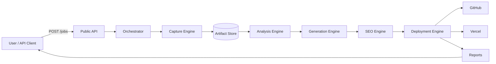

# 00 — Project Overview

> The single-page mental model for everyone working on Go Up Level Vibe Coding.

---

## Purpose

This document is the canonical entry point into the project documentation. It exists to give any new human contributor, AI coding agent, investor, partner, or auditor a complete, accurate, and self-contained understanding of the platform in less than fifteen minutes of reading.

If a contributor has read only one document in the `/docs/` directory, this is the one.

---

## Scope

This document covers:

- The product mission and what the platform does
- The shape of the system at the highest level
- The lifecycle of a single modernization job
- The relationship between this document and the rest of the documentation tree
- The intended audience and how each audience should navigate the docs

It deliberately does not contain:

- Implementation-level details (see documents 07–16)
- API contracts (see `09-api-specification.md`)
- Database schemas (see `08-database-design.md`)
- Operational playbooks (see `18-observability.md` and `27-production-deployment.md`)

---

## What Is Go Up Level Vibe Coding

Go Up Level Vibe Coding (hereafter "Vibe", "the platform", or "GULVC") is an autonomous website modernization platform.

Given the URL of an existing live website, the platform performs end-to-end modernization without further human input. The output is a deployed Next.js application, a GitHub repository, a deployment URL, and a portfolio of reports describing what was changed and why.

The platform is opinionated. It does not redesign websites. It upgrades them. The visual identity, structural intent, and content of the source site are preserved. The technical substrate (framework, hosting, metadata, accessibility, performance, AI discoverability) is replaced with modern equivalents.

The platform's defining characteristic is that the human is removed from the production loop. A human may originate the request and accept the deliverable. Everything in between is software.

---

## Why This Project Exists

The internet contains tens of millions of small websites that are technically obsolete but commercially active. These sites work but are slow, hard to maintain, invisible to AI assistants, weakly indexed, inaccessible to many users, and built on infrastructure no longer suited to modern web standards.

The owners of these sites typically do not need:

- A new identity
- A creative agency
- Custom enterprise software
- A six-figure rebuild

They need a faster, more discoverable, more maintainable version of what they already have. That work is repetitive. Repetitive work is automation territory.

GULVC industrializes that work. It treats website modernization as a software pipeline rather than a service engagement.

---

## What The Platform Produces

For every successful job, the customer receives:

1. A production Next.js application running on Vercel.
2. A GitHub repository owned by the customer or, optionally, by the platform on their behalf.
3. A deployment URL with a default `*.vercel.app` subdomain and optional custom domain support.
4. An SEO report describing changes, scores, and recommendations.
5. An accessibility report.
6. A content map and page inventory.
7. A diff summary showing what changed compared to the source site.
8. An LLM discoverability artifact (`llms.txt`) tuned for AI assistants.

For every job (successful or not), the platform retains:

1. The full HAR capture archive
2. Screenshots
3. The raw HTML, CSS, JS, and asset bundle
4. The structured content extraction
5. All agent traces and reasoning logs
6. All build, test, and deploy logs

These artifacts are addressable, replayable, and exportable.

---

## How The Platform Works (One-Paragraph Summary)

A user (or an upstream system) submits a URL. The platform schedules a job. A capture agent visits the site using a headless browser, records traffic, screenshots pages, and crawls internal links. An analysis agent inspects the captured artifacts to produce a structured representation of the site, including its page inventory, content map, SEO posture, and accessibility posture. A generation agent uses the structured representation to scaffold and populate a Next.js application. An SEO agent enriches the generated code with metadata, structured data, sitemaps, and AI discoverability artifacts. A deployment agent creates a GitHub repository, pushes the generated code, and triggers a Vercel deployment. A delivery agent assembles the customer-facing report and notifies the requester.

---

## High-Level Component Map

This diagram is intentionally lossy. See `02-system-architecture.md` for the authoritative architecture and `03-agent-architecture.md` for the agent boundaries.

---

## Lifecycle Of A Single Job

1. **Intake.** A URL is submitted. The platform validates the URL, ensures the requester has quota, creates a `Job` record, and enqueues it.
2. **Capture.** A capture worker fetches the site, records a HAR file, captures screenshots, and crawls to a configurable depth. Artifacts land in object storage.
3. **Analysis.** An analysis worker reads the captured artifacts and produces a normalized `SiteModel`, including a page inventory, content map, navigation graph, SEO posture, and accessibility posture.
4. **Generation.** A generation worker reads the `SiteModel` and produces a buildable Next.js application as a tree of files in a workspace.
5. **SEO Enhancement.** The SEO engine post-processes the generated application to add metadata, structured data, sitemaps, `robots.txt`, Open Graph tags, and `llms.txt`.
6. **Quality Review.** An automated review runs Lighthouse, axe-core, link checks, and metadata validation. Failures may trigger retries with corrective prompts.
7. **Repository Creation.** A repository is created on GitHub. The generated source is committed.
8. **Deployment.** A Vercel project is provisioned, linked to the repository, and deployed. Build logs and performance metrics are captured.
9. **Delivery.** A report bundle is produced. The customer is notified. The job is marked `delivered`.

Failure at any step routes the job into a retry-or-abort state machine. See `03-agent-architecture.md` for failure semantics.

---

## How To Read The Documentation

The docs are numbered. Lower numbers describe what and why. Higher numbers describe how. The ADR directory captures the durable decisions that constrain all of the above.

Recommended reading paths follow.

### New Human Contributor

1. `00-project-overview.md` (this file)
2. `01-product-requirements-document.md`
3. `02-system-architecture.md`
4. `03-agent-architecture.md`
5. `22-monorepo-structure.md`
6. `26-local-development.md`
7. `20-developer-workflows.md`
8. `21-coding-standards.md`

### Autonomous Coding Agent

Agents should ingest documents in numerical order. The combined `/docs/` tree is designed to be a complete specification. Implementation must conform to the constraints expressed in the ADR directory.

### Product / Business Stakeholder

1. `00-project-overview.md`
2. `01-product-requirements-document.md`
3. `23-milestone-roadmap.md`
4. `28-cost-model.md`
5. `29-future-vision.md`

### Security / Compliance Reviewer

1. `02-system-architecture.md`
2. `17-security-model.md`
3. `18-observability.md`
4. `25-risk-analysis.md`

### Operator / SRE

1. `02-system-architecture.md`
2. `18-observability.md`
3. `27-production-deployment.md`
4. `25-risk-analysis.md`

---

## Glossary

| Term | Meaning |
|------|---------|
| Job | A single end-to-end modernization request, identified by a UUID. |
| Capture | The phase that produces raw artifacts from a source site. |
| HAR | HTTP Archive file. Records all network requests for a page session. |
| SiteModel | The normalized internal representation of a captured site. |
| Workspace | A per-job isolated filesystem and database scope. |
| Generation | The phase that produces a Next.js application from a SiteModel. |
| Engine | A coarse-grained backend service that performs one phase. |
| Agent | A bounded reasoning unit, typically backed by an LLM, that drives an engine. |
| Orchestrator | The component that schedules and sequences engines. |
| Deliverable | The customer-facing artifact bundle produced at the end of a job. |
| RAI | Responsible AI. Content policy and safety considerations. |
| ADR | Architectural Decision Record. |

---

## Assumptions

- The platform is built greenfield. There is no legacy system to integrate with on day one.
- The team has access to commercial LLM APIs (OpenAI, Anthropic, or compatible).
- The team has access to a GitHub organization and a Vercel team account.
- Cloud infrastructure is available (AWS or GCP). The reference implementation assumes AWS unless stated otherwise.
- The MVP is operated by a small team (≤ 5 humans) and a fleet of agents.
- Customers consent to the platform fetching and storing public content from their site.
- Source websites are publicly reachable. Authenticated content is out of scope for MVP.

---

## Design Decisions

| Decision | Rationale |
|----------|-----------|
| Numbered documents | Provides a stable reading order and stable cross-references. |
| ADR directory | Captures durable architectural choices independent of evolving documents. |
| Mermaid diagrams | Renderable on GitHub. Diff-friendly. AI-agent friendly. |
| Single canonical glossary in this file | Avoids term drift between documents. |
| `SiteModel` as a stable intermediate representation | Decouples capture from generation. Enables independent evolution. |
| Per-job workspace isolation | Simplifies failure isolation and security. |
| Autonomous-by-default agent design | Aligns with the long-term product vision. Manual overrides are exceptions. |

---

## Open Questions

- Should the platform support authenticated-site capture in a future milestone? If so, how are credentials handled (see `17-security-model.md`)?
- Should reports be customer-brandable in the white-label tier?
- Is there a quality floor below which a job auto-aborts rather than delivers a degraded result?
- Should the platform offer a "human-in-the-loop review" tier as a paid upgrade or a default fallback?

---

## Future Enhancements

- A continuous modernization mode: the platform monitors the deployed site and the source site, and reapplies upgrades as either evolves.
- A multi-language generation target: today Next.js + TypeScript; tomorrow optionally Astro, Remix, or static HTML for low-cost tiers.
- A marketplace of generation templates contributed by agencies.
- A self-improving generation pipeline that uses production telemetry from delivered sites to refine its prompts and templates.
- An offline mode for capture, enabling on-premises operation for regulated customers.

---

## Cross-References

- Product framing → `01-product-requirements-document.md`
- System shape → `02-system-architecture.md`
- Agent boundaries → `03-agent-architecture.md`
- Engines → `10-capture-engine.md` through `14-deployment-engine.md`
- Integrations → `15-github-integration.md`, `16-vercel-integration.md`
- Quality and safety → `17-security-model.md`, `19-testing-strategy.md`
- Operations → `18-observability.md`, `27-production-deployment.md`
- Decisions → `ADR/`
