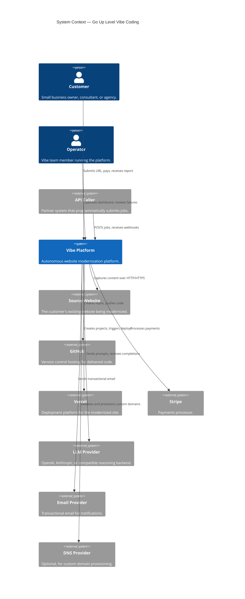
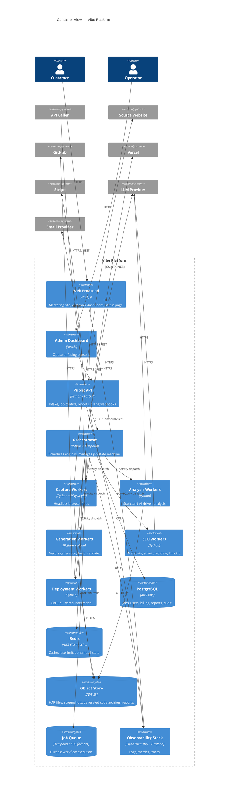
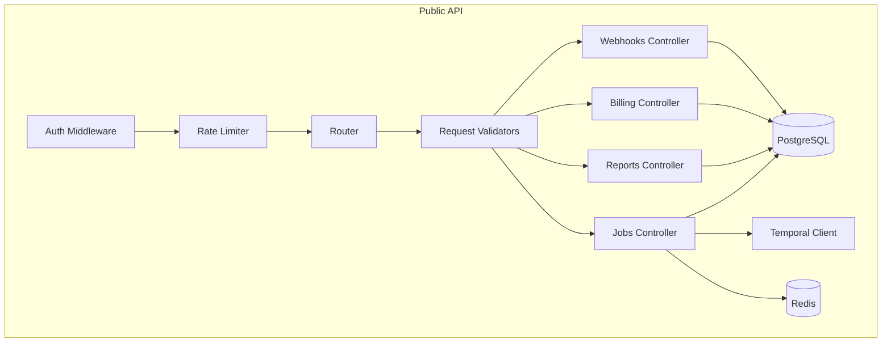
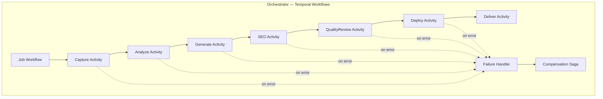
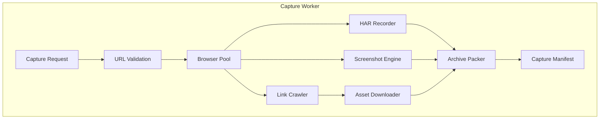
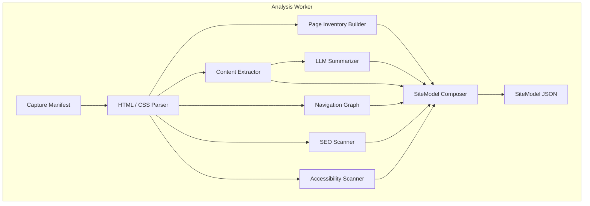
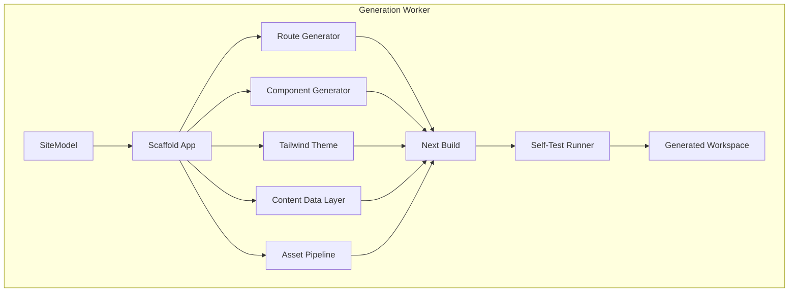
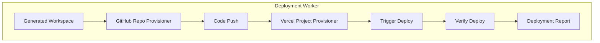
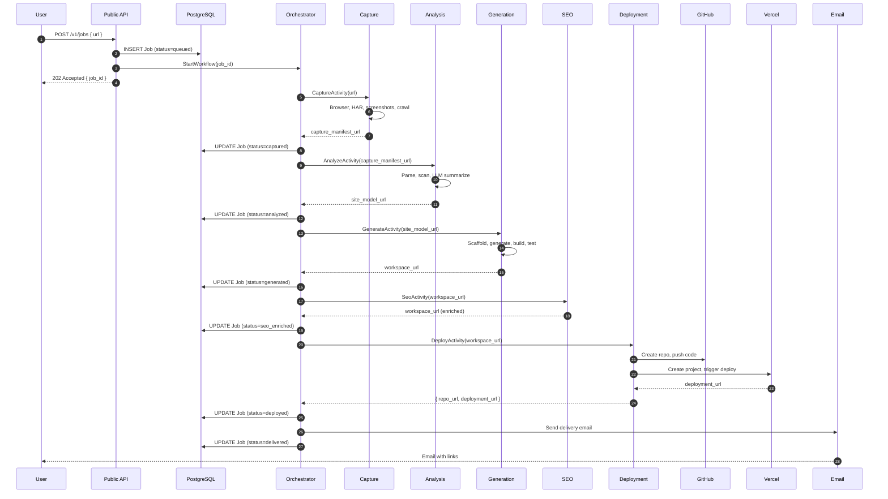
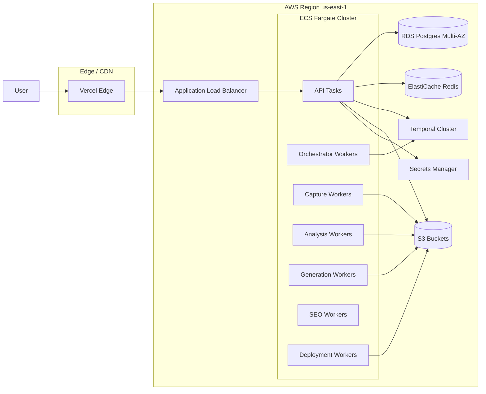

# 02 — System Architecture

> The authoritative architecture description. Defines the boundaries, responsibilities, and protocols of every component in the platform.

---

## Purpose

This document defines the system architecture of Go Up Level Vibe Coding. It describes the platform at four levels of detail using the C4 model (Context, Container, Component, Code), supplemented with data flow diagrams.

It is the contract that subsequent technical documents (`07-technical-specification.md`, `08-database-design.md`, `09-api-specification.md`, and the engine documents) elaborate.

If an implementation choice in any other document contradicts a constraint in this architecture document, this document wins until updated by a corresponding ADR.

---

## Scope

In scope:

- C4 Level 1 — System Context
- C4 Level 2 — Containers
- C4 Level 3 — Components (per major container)
- C4 Level 4 — Code-level diagrams for the most consequential modules
- Data flow diagrams for the canonical job lifecycle
- Deployment topology
- Failure boundaries and isolation strategy

Out of scope:

- Specific framework versions (see `07-technical-specification.md`)
- Schema definitions (see `08-database-design.md`)
- API endpoint contracts (see `09-api-specification.md`)
- Operational runbooks (see `27-production-deployment.md`)

---

## Architectural Principles

The architecture is constrained by the following principles. They are listed in priority order. When two principles conflict, the higher principle wins.

1. **Autonomous operation is the default.** No component requires a human in the loop to complete normal work.
2. **Failure must be observable and replayable.** Every step produces durable artifacts. Every step can be rerun from its inputs.
3. **Boundaries are explicit and contractual.** Components communicate through documented interfaces, never through shared mutable state.
4. **Stateless workers, stateful storage.** Workers can be killed and restarted. State lives in the database, object store, or queue.
5. **Per-job isolation.** Each job has its own workspace, its own logs, and its own credential scope.
6. **Idempotent operations.** Any operation can be safely retried without producing duplicate side effects.
7. **Versioned interfaces.** All cross-component contracts are versioned. Breaking changes require a major version bump.
8. **One reason to change per component.** Components are organized by responsibility, not by technical layer.

---

## C4 Level 1 — System Context

### External Dependencies

| Dependency | Purpose | Failure Mode |
|------------|---------|--------------|
| Source Website | Input | Job aborts with `capture_failed` if unreachable. |
| GitHub | Code delivery | Job pauses with `delivery_blocked` if API rate limit or outage. Retried with exponential backoff. |
| Vercel | Deployment | Job pauses with `deploy_blocked`. Retried. |
| Stripe | Billing | Job creation is blocked at intake. |
| LLM Provider | Reasoning | Engines retry with fallback provider if available. |
| Email Provider | Notifications | Notifications buffered and retried. Does not block job. |
| DNS Provider | Custom domains | Optional. Job delivers with default Vercel subdomain if DNS fails. |

---

## C4 Level 2 — Containers

A "container" here is a runtime-deployable unit (a service, a worker pool, a database, a queue).

### Container Catalogue

| Container | Runtime | Scaling | Owns |
|-----------|---------|---------|------|
| Web Frontend | Next.js on Vercel | Vercel autoscaling | Marketing, customer dashboard. |
| Admin Dashboard | Next.js on Vercel | Vercel autoscaling | Operator console. Internal auth only. |
| Public API | FastAPI on AWS ECS Fargate | Horizontal, target CPU 60% | Stateless HTTP surface. |
| Orchestrator | Temporal Cluster (self-hosted or Temporal Cloud) | Vertical for the cluster, horizontal for workers | Durable workflow execution. |
| Capture Workers | Python + Playwright on ECS Fargate (or dedicated EC2 for browser pool) | Horizontal, queue-depth-based | Browser automation. |
| Analysis Workers | Python on ECS Fargate | Horizontal, queue-depth-based | Static + AI analysis. |
| Generation Workers | Python + Node on ECS Fargate | Horizontal, queue-depth-based | Code generation, build, validate. |
| SEO Workers | Python on ECS Fargate | Horizontal | Metadata, structured data, llms.txt. |
| Deployment Workers | Python on ECS Fargate | Horizontal | GitHub + Vercel calls. |
| PostgreSQL | AWS RDS Multi-AZ | Vertical, read replicas | Transactional state. |
| Redis | AWS ElastiCache | Cluster mode | Cache, rate limit, locks. |
| Object Store | AWS S3 with versioning | Native | Artifacts. |
| Queue / Workflow | Temporal or SQS fallback | Native | Durable job execution. |
| Observability | Grafana Cloud or self-hosted Loki/Tempo/Prom | Native | Telemetry. |

---

## C4 Level 3 — Components

### Public API

Components:

- **Auth Middleware** — Validates JWT (customer) or API key (partner). Resolves the tenant context.
- **Rate Limiter** — Token-bucket per tenant in Redis. Enforces tier-specific limits (see `17-security-model.md`).
- **Router** — FastAPI routing.
- **Validators** — Pydantic models. All request and response shapes are typed.
- **Jobs Controller** — Creates jobs, exposes status, cancels jobs.
- **Reports Controller** — Returns signed URLs to report bundles.
- **Billing Controller** — Stripe checkout sessions, webhook ingestion, quota updates.
- **Webhooks Controller** — Receives provider callbacks (Stripe, Vercel, GitHub).

### Orchestrator

The orchestrator is a Temporal workflow that owns the lifecycle of one job. Each engine appears as an `Activity`. Activities dispatch to worker pools that run the actual engine code.

Workflow features:

- Per-activity retry policies (configured per engine).
- Per-activity timeouts.
- Saga-style compensation (e.g., delete created GitHub repo if Vercel deploy fails irrecoverably).
- Versioned workflow definitions to support safe rollouts.

### Capture Worker

See `10-capture-engine.md` for full detail.

### Analysis Worker

See `11-analysis-engine.md` for full detail.

### Generation Worker

See `12-generation-engine.md` for full detail.

### Deployment Worker

See `14-deployment-engine.md`, `15-github-integration.md`, `16-vercel-integration.md`.

---

## Data Flow — Canonical Job Lifecycle

---

## Failure Boundaries

A failure boundary is a place where a fault cannot cross without a deliberate handoff.

| Boundary | Why It Exists |
|----------|---------------|
| Per-job workspace | Isolates corrupted or malicious source content. |
| Per-worker container | Browser crashes do not take down the platform. |
| Per-tenant credential scope | A leak in one tenant does not expose others. |
| Per-engine activity | A retry in one engine does not redo prior engines. |
| Per-deployment GitHub App installation | A token revocation by one customer does not affect others. |

---

## Deployment Topology

Notes:

- The web frontend runs on Vercel for SEO and performance benefits.
- All backend services run on AWS in a single primary region with cross-AZ redundancy.
- A V3 milestone introduces multi-region for capture latency and DR.

---

## Cross-Cutting Concerns

### Configuration

- All configuration is environment-variable driven.
- Secrets live in AWS Secrets Manager and are mounted to ECS tasks at boot.
- Application config is versioned in a `config/` directory in the monorepo and validated by a Pydantic schema at boot.

### Observability

- All services emit OpenTelemetry traces, metrics, and structured logs.
- Trace context propagates through Temporal workflows via custom interceptors.
- See `18-observability.md`.

### Security

- TLS in transit, KMS-encrypted at rest.
- Customer artifacts are partitioned by tenant prefix in S3.
- Workers run with the least privilege IAM role that satisfies their function.
- See `17-security-model.md`.

### Versioning

- All cross-component contracts (REST APIs, Temporal workflow signatures, S3 artifact schemas) are versioned.
- A deprecation policy applies to API v1 surfaces from V2 onward.

---

## Assumptions

- AWS is the primary cloud. The architecture is portable to GCP but not designed for multi-cloud day one.
- Temporal is acceptable as a managed dependency. If not, the orchestrator falls back to SQS + a custom state machine (see ADR-005).
- A single region is acceptable for MVP latency and reliability targets.

---

## Design Decisions

| Decision | Rationale |
|----------|-----------|
| C4 model for documentation | Industry-standard, agent-readable, scales. |
| Mermaid diagrams | Source-controllable, diff-able. |
| Temporal for orchestration | Durable state, retries, versioning out of the box. |
| Per-job workspace | Failure isolation, security, replayability. |
| Stateless workers | Horizontal scaling, no in-process state. |
| Object storage for all artifacts | Cheap, durable, addressable. |

---

## Open Questions

- Should we run our own Temporal cluster or use Temporal Cloud for V1?
- Is RDS Postgres the right default versus Aurora Serverless v2?
- At what scale does the browser pool warrant a dedicated EC2 fleet versus Fargate?
- Do we need a separate "preview" environment per pull request, or is staging sufficient?

---

## Future Enhancements

- Multi-region active-active for capture workers (lower latency to source sites).
- A dedicated browser pool service (something like Browserless) extracted out of capture workers.
- A managed `SiteModel` schema registry (e.g., Buf Schema Registry) for cross-language consumers.
- An event bus (Kafka or Kinesis) for downstream analytics consumers.

---

## Cross-References

- Technical choices → `07-technical-specification.md`
- Per-engine deep dives → `10-capture-engine.md` through `14-deployment-engine.md`
- Database schema → `08-database-design.md`
- API surface → `09-api-specification.md`
- ADRs → `ADR/`
