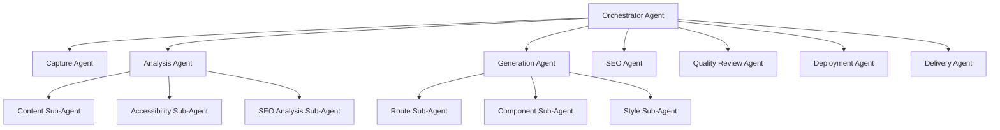

# 03 — Agent Architecture

> Defines the bounded reasoning units that compose the platform. Each agent is a contract: known inputs, known outputs, known tools, known failure modes.

---

## Purpose

This document defines the agent architecture of Vibe. It complements `02-system-architecture.md`, which defines the system at the container and component level. Where `02` describes processes, this document describes the bounded reasoning units that drive those processes.

An "agent" in this codebase is not synonymous with "LLM call". An agent is a process that:

1. Takes a typed input
2. Produces a typed output
3. May use tools (LLMs, browsers, code generators, deployment APIs)
4. Has a known set of failure modes and a documented retry strategy
5. Emits structured traces that allow its reasoning to be replayed

Some agents are LLM-driven. Some are deterministic. Most are hybrids: a deterministic spine with LLM-driven decisions at well-defined branch points.

---

## Scope

This document defines:

- The agent taxonomy
- The contract of each agent (inputs, outputs, tools, state, failure modes, retry strategy)
- How agents are composed into a job pipeline
- Cross-agent invariants

It does not define:

- The engine internals of each agent (see documents `10` through `14`)
- The orchestrator implementation (see `02-system-architecture.md`)
- Prompt templates (those live in `apps/agents/<agent>/prompts/`)

---

## Agent Design Principles

1. **Typed contracts.** Every agent input and output is a Pydantic model with a stable schema. Schemas are versioned.
2. **Deterministic spines.** LLM calls happen at decision points, not as the orchestration backbone.
3. **Tool-mediated side effects.** Agents do not call external systems directly. They invoke registered tools whose calls are logged and auditable.
4. **Pure inputs to pure outputs.** Given the same inputs, the same toolchain, and a fixed random seed, an agent should produce equivalent outputs.
5. **Bounded autonomy.** Each agent has an explicit scope. It may not exceed its scope without escalating to the orchestrator.
6. **Replayable.** Every agent run is recorded with inputs, tool calls, intermediate outputs, and final output, sufficient to reproduce its behavior offline.
7. **Cost-aware.** Each agent declares a target cost envelope (USD per job). Exceeding the envelope triggers a guard.
8. **Failure-honest.** Agents prefer to fail loudly than to deliver a degraded result silently.

---

## Agent Taxonomy



Top-level agents are first-class and own a Temporal activity. Sub-agents are in-process modules invoked by their parent. Sub-agents may still use LLMs and tools, but they do not cross workflow boundaries.

---

## The Orchestrator Agent

### Role

Owns the lifecycle of one job. Sequences top-level agents, handles failures, and emits state transitions.

### Inputs

- `JobSpec` — the user-submitted job description.
- `TenantContext` — billing, quota, feature flags.

### Outputs

- `JobOutcome` — terminal state (`delivered`, `failed`, `aborted`), with references to artifacts and reports.

### Tools

- Temporal client (workflow execution)
- Database (job state)
- Notification dispatcher (email, webhook)

### State

Owns the canonical `Job.status` field. Persists state transitions to PostgreSQL via the activity completion side effect.

### Failure Modes

| Failure | Handling |
|---------|----------|
| Agent activity timeout | Activity-level retry per policy. Workflow continues. |
| Agent activity permanent failure | Workflow transitions to `failed`. Saga compensations run. |
| Workflow worker crash | Temporal automatically resumes on another worker. |
| Tenant quota exhausted mid-job | Workflow pauses, awaits signal from billing. |

### Retry Strategy

- Activity retries: exponential backoff with jitter, max 5 attempts, capped at 30 minutes.
- Workflow retries: not retried at workflow level; retries happen at activity level.

---

## The Capture Agent

### Role

Produces a faithful artifact archive of the source website.

### Inputs

```python
class CaptureRequest(BaseModel):
    job_id: UUID
    url: HttpUrl
    crawl_depth: int = 2
    max_pages: int = 50
    viewport: Literal["desktop", "mobile", "both"] = "both"
    respect_robots: bool = True
    user_agent: str = "VibeBot/1.0 (+https://vibe.dev/bot)"
```

### Outputs

```python
class CaptureManifest(BaseModel):
    job_id: UUID
    root_url: HttpUrl
    pages: list[CapturedPage]
    assets: list[CapturedAsset]
    har_archive_uri: str  # s3://...
    screenshots_uri: str  # s3://... (prefix)
    captured_at: datetime
    capture_duration_ms: int
    warnings: list[str]
```

### Tools

- Playwright browser pool
- HAR recorder
- Robots.txt parser
- DNS resolver
- HTTP client for asset downloads
- S3 client for artifact storage

### State

- Per-page completion checkpoint in Redis, keyed by `job_id`. Allows partial-result resume.
- Final manifest written to PostgreSQL and S3.

### Failure Modes

| Failure | Handling |
|---------|----------|
| DNS resolution failure | Abort with `capture_failed_dns`. No retry. |
| `robots.txt` disallow | Abort with `capture_blocked_by_robots`. No retry. |
| HTTP 5xx on root | Retry with backoff up to 3 attempts, then abort with `capture_failed_origin`. |
| Captcha or bot wall | Abort with `capture_blocked_bot_wall`. Operator-reviewable. |
| Partial crawl (some pages fail) | Continue with warnings. Manifest marks failed pages. |
| Browser crash | Restart browser, resume from checkpoint. |
| Timeout > 15 minutes | Abort with `capture_timeout`. Manual rerun possible. |

### Retry Strategy

- Per-page: 2 attempts.
- Per-job: 1 retry on transient errors; no retry on bot-wall or robots disallow.

---

## The Analysis Agent

### Role

Converts captured artifacts into a structured `SiteModel`.

### Inputs

```python
class AnalysisRequest(BaseModel):
    job_id: UUID
    capture_manifest_uri: str
```

### Outputs

```python
class SiteModel(BaseModel):
    job_id: UUID
    site_name: str | None
    industry_guess: str | None
    locale: str
    pages: list[PageModel]
    navigation: NavigationGraph
    content_map: ContentMap
    seo_audit: SeoAudit
    accessibility_audit: AccessibilityAudit
    assets: list[AssetRecord]
    detected_tech: list[str]
    schema_version: str = "1.0.0"
```

### Tools

- HTML parser (BeautifulSoup, lxml)
- CSS parser
- Lighthouse static rules
- axe-core ruleset (run via headless browser on captured HTML)
- LLM (for content summarization, industry classification, navigation inference)
- Schema validator

### State

- Stateless. Each invocation reads from S3, writes a new `SiteModel` to S3, and updates Postgres.

### Failure Modes

| Failure | Handling |
|---------|----------|
| Capture manifest missing or corrupt | Abort with `analysis_missing_input`. |
| LLM provider unavailable | Failover to secondary provider. If both fail, abort with retry. |
| Site has zero pages after filtering | Abort with `analysis_no_pages`. |
| Detected tech is unsupported (e.g., heavy SPA with no SSR HTML) | Mark warning; downgrade target template. |
| Industry classification low-confidence | Use generic template. Warning logged. |

### Retry Strategy

- 3 attempts with exponential backoff for transient LLM failures.
- No retry for structural failures.

---

## The Generation Agent

### Role

Produces a buildable Next.js workspace from a `SiteModel`.

### Inputs

```python
class GenerationRequest(BaseModel):
    job_id: UUID
    site_model_uri: str
    template: str = "default"
    feature_flags: dict[str, bool] = {}
```

### Outputs

```python
class GenerationResult(BaseModel):
    job_id: UUID
    workspace_archive_uri: str  # s3://...
    build_log_uri: str
    test_log_uri: str
    lighthouse_pre_deploy: LighthouseReport
    files_generated: int
    components_generated: int
    routes_generated: int
```

### Tools

- Template registry (Jinja2-based scaffolds plus AST-level codegen)
- Node.js toolchain (Next.js, TypeScript, Tailwind, ESLint, Prettier)
- LLM (for component synthesis when no template match)
- Internal validator (typecheck, build, smoke-test)

### State

- Per-job ephemeral workspace on local disk.
- Final workspace archived to S3.

### Failure Modes

| Failure | Handling |
|---------|----------|
| `next build` fails | Self-repair loop: capture error, prompt LLM with error + offending file, regenerate, re-build. Max 3 self-repair attempts. |
| Type errors | Same self-repair loop with `tsc` errors. |
| Lighthouse score below threshold pre-deploy | Run optimization sub-agent, regenerate problematic routes. |
| Workspace size exceeds 1 GB | Abort with `generation_oversized`. Operator review. |
| LLM produces unsafe code (detected by static analysis) | Abort with `generation_unsafe_output`. |

### Retry Strategy

- 3 self-repair attempts per build error.
- 2 outer retries on transient infrastructure failures.

---

## The SEO Agent

### Role

Enriches the generated workspace with metadata, structured data, sitemaps, and AI discoverability artifacts.

### Inputs

```python
class SeoRequest(BaseModel):
    job_id: UUID
    workspace_archive_uri: str
    site_model_uri: str
```

### Outputs

```python
class SeoResult(BaseModel):
    job_id: UUID
    workspace_archive_uri: str  # enriched
    seo_changes: list[SeoChange]
    llms_txt_uri: str
    sitemap_uri: str
```

### Tools

- Schema.org templates per industry
- LLM (for page-level description generation, llms.txt synthesis)
- Sitemap generator
- robots.txt builder
- Open Graph image generator (optional, via OG image API)

### State

- Stateless.

### Failure Modes

| Failure | Handling |
|---------|----------|
| Generated metadata fails JSON-LD validation | Regenerate; if still invalid, ship valid subset and warn. |
| OG image generation fails | Fall back to a default branded image. |
| LLM exceeds cost envelope | Truncate llms.txt; warning logged. |

### Retry Strategy

- 2 attempts per LLM call.
- Always ship even if optional enhancements fail.

---

## The Quality Review Agent

### Role

Validates that the generated, SEO-enriched workspace meets quality gates before deployment.

### Inputs

```python
class QualityReviewRequest(BaseModel):
    job_id: UUID
    workspace_archive_uri: str
    thresholds: QualityThresholds
```

### Outputs

```python
class QualityReviewResult(BaseModel):
    job_id: UUID
    passed: bool
    lighthouse: LighthouseReport
    axe: AxeReport
    link_check: LinkCheckReport
    metadata_check: MetadataCheckReport
    blockers: list[QualityBlocker]
```

### Tools

- Lighthouse CLI
- axe-core CLI
- Internal link-checker
- Metadata validator (JSON-LD, OG, Twitter cards)

### Failure Modes

| Failure | Handling |
|---------|----------|
| Lighthouse below threshold | Mark `passed=False` with blockers. Orchestrator routes back to Generation Agent with corrective input. |
| Critical accessibility blocker | Same as above. |
| Broken internal links | Auto-fix if possible (re-link to nearest equivalent); otherwise blocker. |
| Tool crash | Retry; if persistent, mark as inconclusive and require operator review. |

### Retry Strategy

- One full re-review after a Generation Agent self-repair loop.
- Maximum two end-to-end Generation + Review loops per job.

---

## The Deployment Agent

### Role

Provisions and publishes the generated workspace to GitHub and Vercel.

### Inputs

```python
class DeploymentRequest(BaseModel):
    job_id: UUID
    tenant_id: UUID
    workspace_archive_uri: str
    repo_visibility: Literal["public", "private"] = "private"
    github_org: str | None
    vercel_team: str | None
    custom_domain: str | None
```

### Outputs

```python
class DeploymentResult(BaseModel):
    job_id: UUID
    repo_url: HttpUrl
    repo_default_branch: str
    deployment_url: HttpUrl
    deployment_id: str
    build_log_uri: str
    custom_domain_status: Literal["not_requested", "pending", "active", "failed"]
```

### Tools

- GitHub API (via installation-scoped token)
- Vercel API (via team-scoped token)
- DNS validation client (optional)
- Git client (local clone, commit, push)

### State

- Records repo and deployment IDs in PostgreSQL.
- Compensation registry tracks what was created, in case of saga rollback.

### Failure Modes

| Failure | Handling |
|---------|----------|
| GitHub API rate limit | Backoff; retry. |
| Repo name conflict | Append disambiguator; retry once. |
| Vercel project creation conflict | Same. |
| Vercel build failure | Capture logs, route back to Generation Agent for diagnosis; max 2 redeploys. |
| Custom domain validation pending after 24 h | Mark domain `pending`; deliver default URL. |

### Retry Strategy

- 5 attempts on transient GitHub/Vercel failures.
- 2 redeploys on Vercel build failures.

---

## The Delivery Agent

### Role

Produces the customer-facing report bundle and notifies the requester.

### Inputs

```python
class DeliveryRequest(BaseModel):
    job_id: UUID
    deployment_result: DeploymentResult
    quality_result: QualityReviewResult
    site_model_uri: str
```

### Outputs

```python
class DeliveryResult(BaseModel):
    job_id: UUID
    report_bundle_uri: str
    customer_notified: bool
    webhook_dispatched: bool
```

### Tools

- Report renderer (Markdown + HTML + PDF via Playwright print)
- Email dispatcher
- Webhook dispatcher (HMAC-signed payloads)
- Customer dashboard updater

### State

- Stateless.

### Failure Modes

| Failure | Handling |
|---------|----------|
| Email provider down | Retry; if persistent, mark delivered with pending notification. |
| Webhook endpoint returns non-2xx | Retry with exponential backoff up to 24 h. Dead-letter after that. |
| Report rendering fails | Ship a Markdown-only report; flag for operator follow-up. |

### Retry Strategy

- 3 attempts for email.
- Up to 24 h backoff for webhooks.

---

## Cross-Agent Invariants

1. **Trace continuity.** A single `job_id` and `trace_id` propagate through every agent.
2. **Artifact addressability.** Every output is addressable by a deterministic S3 URI of the form `s3://vibe-artifacts/{tenant_id}/{job_id}/{stage}/{filename}`.
3. **Schema versioning.** Every typed input/output declares `schema_version`. Agents reject unknown major versions.
4. **Cost envelope.** Each agent declares `max_cost_usd`. Orchestrator aborts jobs that exceed cumulative envelopes.
5. **Idempotence keys.** Every external side effect (create repo, create Vercel project) is keyed by `job_id` so retries do not double-create.
6. **Compensation.** Every side-effecting agent registers a compensation that the saga can invoke.

---

## Agent Communication

Agents do not call each other directly. The orchestrator is the only caller. This is intentional and the property is enforced by:

- Agents being packaged as Temporal activities, callable only via the workflow runtime.
- Static analysis in CI that rejects cross-agent imports outside `apps/orchestrator/`.

For data exchange, agents read and write artifacts in S3 referenced by URIs. Large payloads are never passed through workflow signals.

---

## Tool Catalogue

Each tool is a typed Python module with the following interface:

```python
class Tool(Protocol):
    name: str
    schema_version: str

    async def call(self, params: ToolParams) -> ToolResult: ...
    async def cost_estimate(self, params: ToolParams) -> Decimal: ...
```

| Tool | Category | Used By | Cost Driver |
|------|----------|---------|-------------|
| `browser.playwright` | Browser automation | Capture | Browser-minute |
| `parser.html` | Parsing | Analysis | CPU |
| `parser.css` | Parsing | Analysis | CPU |
| `llm.openai` | LLM | Analysis, Generation, SEO | Token |
| `llm.anthropic` | LLM | Analysis, Generation, SEO | Token |
| `codegen.template` | Generation | Generation | CPU |
| `codegen.next_builder` | Generation | Generation | Build-minute |
| `lighthouse.cli` | Quality | Quality Review | Run |
| `axe.cli` | Quality | Quality Review | Run |
| `github.api` | Integration | Deployment | API call |
| `vercel.api` | Integration | Deployment | API call |
| `email.dispatch` | Notification | Delivery | Send |
| `webhook.dispatch` | Notification | Delivery | Send |
| `s3.client` | Storage | All | Storage GB-month + request |

---

## Cost Envelopes

Indicative envelopes per agent, per job, at MVP target volumes. See `28-cost-model.md` for derivations.

| Agent | Cost Envelope (USD) |
|-------|---------------------|
| Orchestrator | 0.05 |
| Capture | 0.25 |
| Analysis | 0.60 |
| Generation | 1.80 |
| SEO | 0.30 |
| Quality Review | 0.20 |
| Deployment | 0.10 |
| Delivery | 0.05 |
| **Total** | **3.35** |

The COGS target for MVP is ≤ $5/job. The envelope above leaves headroom for variability.

---

## Observability

Every agent invocation produces:

- An OpenTelemetry span with attributes for `agent.name`, `agent.version`, `job_id`, `tenant_id`, `cost_usd`, `tokens_in`, `tokens_out`.
- A structured log line at start and end.
- A `tool_call` event per tool invocation.
- An audit row in the `agent_runs` table.

See `18-observability.md`.

---

## Assumptions

- LLMs are reliable enough to drive analysis, generation, and SEO with appropriate guardrails.
- Tool calls can be made cost-bounded by upstream guards.
- Replayability does not require deterministic LLMs; sufficient determinism is provided by recorded tool calls.

---

## Design Decisions

| Decision | Rationale |
|----------|-----------|
| Deterministic spines with LLM decision points | Maximizes reliability, observability, debuggability. |
| Agents as Temporal activities | Durable retries, timeouts, versioning. |
| Single-orchestrator topology | No agent-to-agent fan-out simplifies tracing and failure handling. |
| Cost envelopes as first-class metadata | Forces explicit reasoning about COGS. |
| Compensation registry | Required for safe saga rollback on multi-system failures. |

---

## Open Questions

- Should the Generation Agent be split into Route and Component agents at the workflow level?
- Should we adopt an agent framework (LangGraph, CrewAI, AutoGen) or maintain in-house orchestration on Temporal?
- How much LLM determinism should we enforce (temperature 0, seeded sampling)?
- Should the Quality Review Agent be allowed to mutate the workspace (auto-fix) or strictly observe?

---

## Future Enhancements

- Multi-agent debate or critic patterns for Generation quality.
- A learned router that picks the cheapest LLM provider per task in real time.
- A shared episodic memory store across agents (e.g., for cross-job pattern recognition).
- An "ensemble" mode where multiple Generation Agents propose, and a Critic Agent selects.

---

## Cross-References

- Per-engine internals → `10-capture-engine.md` through `14-deployment-engine.md`
- Workflow runtime → `02-system-architecture.md`
- Cost model → `28-cost-model.md`
- ADR-005 (orchestration choice) → `ADR/ADR-005-agent-orchestration.md`
