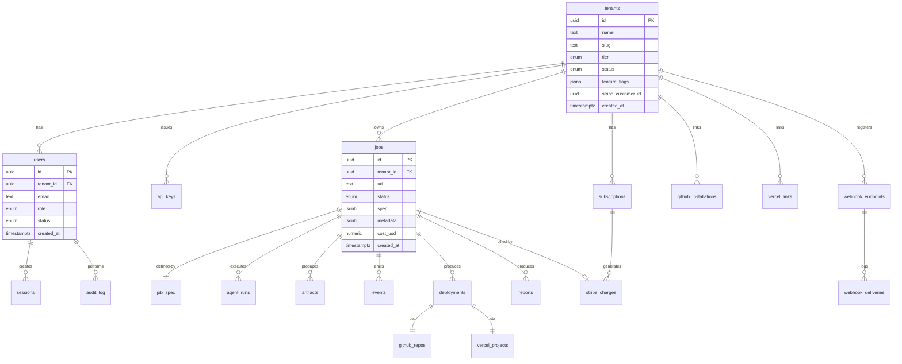
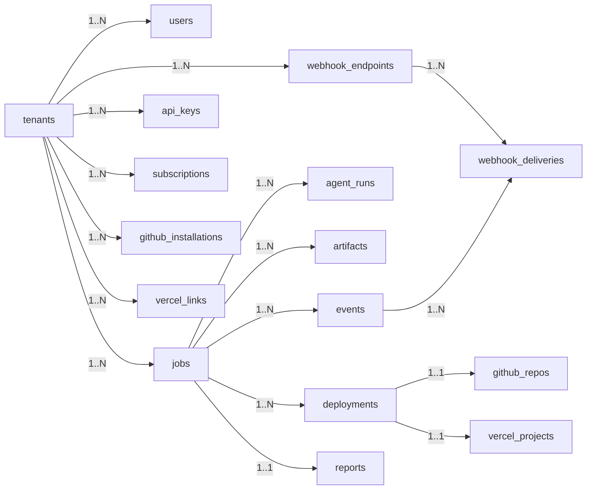

# 08 — Database Design

> The persistent data model that backs the platform. Tables, relationships, indexes, and migrations.

---

## Purpose

This document defines the PostgreSQL data model that powers Vibe. It specifies tables, columns, indexes, constraints, relationships, and the migration strategy. It is the contract between the application code and the database.

The database is the canonical source of truth for transactional state. Artifacts (HAR files, generated workspaces) live in object storage; the database tracks references to them.

---

## Scope

In scope:

- Tables, columns, data types, constraints
- Indexes and partial indexes
- Foreign keys and referential integrity rules
- Enumerations
- Migration policy and tooling
- Multi-tenancy strategy

Out of scope:

- Application-level access patterns (the data-access layer is documented inline in code)
- Query optimization examples beyond the index design
- Backups and disaster recovery (`27-production-deployment.md`)

---

## Design Principles

1. **Multi-tenant by default.** Every tenant-scoped table includes `tenant_id` and is filtered on every query.
2. **Soft deletes for customer data.** A `deleted_at` timestamp preserves auditability.
3. **Hard deletes for transient data.** Ephemeral state (rate-limit counters, tokens) is hard-deleted.
4. **UUID primary keys (v7).** Time-ordered UUIDs for index locality and global uniqueness.
5. **Append-only for events.** Domain events and audit logs are insert-only.
6. **Strong typing via enums.** Status fields are Postgres enums to prevent invalid states.
7. **All timestamps are `timestamptz` (UTC).**
8. **No business logic in stored procedures.** Application code is the source of truth.
9. **Migrations are forward-only.** Rollbacks are achieved by writing a new migration.
10. **Schema changes are reversible-in-effect.** Always add columns nullable first; populate; then constrain.

---

## Entity-Relationship Diagram



This diagram shows the major entity relationships. The full schema is below.

---

## Enumerations

```sql
CREATE TYPE tenant_tier AS ENUM (
  'free',
  'lite',
  'standard',
  'pro',
  'agency_starter',
  'agency_pro',
  'api_payg',
  'api_volume'
);

CREATE TYPE tenant_status AS ENUM (
  'active',
  'suspended',
  'closed'
);

CREATE TYPE user_role AS ENUM (
  'owner',
  'admin',
  'operator',
  'viewer'
);

CREATE TYPE user_status AS ENUM (
  'active',
  'invited',
  'suspended'
);

CREATE TYPE job_status AS ENUM (
  'queued',
  'capturing',
  'captured',
  'analyzing',
  'analyzed',
  'generating',
  'generated',
  'seo_enriching',
  'seo_enriched',
  'quality_review',
  'reviewing',
  'deploying',
  'deployed',
  'delivering',
  'delivered',
  'failed',
  'aborted',
  'cancelled'
);

CREATE TYPE job_origin AS ENUM (
  'web',
  'api',
  'csv',
  'maintenance',
  'admin'
);

CREATE TYPE artifact_kind AS ENUM (
  'capture_manifest',
  'har',
  'screenshot',
  'site_model',
  'workspace_archive',
  'report_md',
  'report_pdf',
  'build_log',
  'lighthouse_report',
  'axe_report',
  'llms_txt',
  'sitemap',
  'other'
);

CREATE TYPE deployment_provider AS ENUM (
  'vercel'
);

CREATE TYPE deployment_status AS ENUM (
  'pending',
  'building',
  'ready',
  'error',
  'cancelled'
);

CREATE TYPE webhook_event AS ENUM (
  'job.created',
  'job.captured',
  'job.analyzed',
  'job.generated',
  'job.deployed',
  'job.delivered',
  'job.failed',
  'job.cancelled'
);

CREATE TYPE webhook_delivery_status AS ENUM (
  'pending',
  'delivered',
  'failed',
  'dead_letter'
);

CREATE TYPE subscription_status AS ENUM (
  'active',
  'paused',
  'past_due',
  'cancelled'
);
```

---

## Tables

### `tenants`

The top-level account. Every other tenant-scoped row references `tenants.id`.

```sql
CREATE TABLE tenants (
  id              UUID PRIMARY KEY DEFAULT uuidv7(),
  slug            TEXT NOT NULL UNIQUE,
  name            TEXT NOT NULL,
  tier            tenant_tier NOT NULL DEFAULT 'free',
  status          tenant_status NOT NULL DEFAULT 'active',
  stripe_customer_id TEXT UNIQUE,
  feature_flags   JSONB NOT NULL DEFAULT '{}'::jsonb,
  region          TEXT NOT NULL DEFAULT 'us',
  created_at      TIMESTAMPTZ NOT NULL DEFAULT now(),
  updated_at      TIMESTAMPTZ NOT NULL DEFAULT now(),
  deleted_at      TIMESTAMPTZ,
  CONSTRAINT tenants_slug_lowercase CHECK (slug = lower(slug))
);

CREATE INDEX tenants_status_idx ON tenants (status) WHERE deleted_at IS NULL;
CREATE INDEX tenants_stripe_customer_idx ON tenants (stripe_customer_id) WHERE stripe_customer_id IS NOT NULL;
```

### `users`

A human identity. Linked to a tenant.

```sql
CREATE TABLE users (
  id              UUID PRIMARY KEY DEFAULT uuidv7(),
  tenant_id       UUID NOT NULL REFERENCES tenants(id) ON DELETE RESTRICT,
  email           CITEXT NOT NULL,
  role            user_role NOT NULL,
  status          user_status NOT NULL DEFAULT 'invited',
  last_login_at   TIMESTAMPTZ,
  mfa_enrolled    BOOLEAN NOT NULL DEFAULT false,
  created_at      TIMESTAMPTZ NOT NULL DEFAULT now(),
  updated_at      TIMESTAMPTZ NOT NULL DEFAULT now(),
  deleted_at      TIMESTAMPTZ,
  CONSTRAINT users_email_per_tenant UNIQUE (tenant_id, email)
);

CREATE INDEX users_email_global_idx ON users (email);
CREATE INDEX users_tenant_idx ON users (tenant_id) WHERE deleted_at IS NULL;
```

### `sessions`

Refresh-token sessions for the customer dashboard.

```sql
CREATE TABLE sessions (
  id              UUID PRIMARY KEY DEFAULT uuidv7(),
  user_id         UUID NOT NULL REFERENCES users(id) ON DELETE CASCADE,
  refresh_token_hash TEXT NOT NULL,
  user_agent      TEXT,
  ip_address      INET,
  expires_at      TIMESTAMPTZ NOT NULL,
  revoked_at      TIMESTAMPTZ,
  created_at      TIMESTAMPTZ NOT NULL DEFAULT now()
);

CREATE INDEX sessions_user_idx ON sessions (user_id) WHERE revoked_at IS NULL;
CREATE INDEX sessions_expires_idx ON sessions (expires_at) WHERE revoked_at IS NULL;
```

### `api_keys`

API keys for partner / programmatic access.

```sql
CREATE TABLE api_keys (
  id              UUID PRIMARY KEY DEFAULT uuidv7(),
  tenant_id       UUID NOT NULL REFERENCES tenants(id) ON DELETE CASCADE,
  name            TEXT NOT NULL,
  key_prefix      TEXT NOT NULL,  -- visible portion, e.g. "vibe_live_abc"
  key_hash        TEXT NOT NULL,  -- argon2id of the full key
  scopes          TEXT[] NOT NULL DEFAULT '{}',
  last_used_at    TIMESTAMPTZ,
  expires_at      TIMESTAMPTZ,
  revoked_at      TIMESTAMPTZ,
  created_at      TIMESTAMPTZ NOT NULL DEFAULT now(),
  created_by      UUID REFERENCES users(id)
);

CREATE INDEX api_keys_tenant_idx ON api_keys (tenant_id) WHERE revoked_at IS NULL;
CREATE UNIQUE INDEX api_keys_prefix_unique ON api_keys (key_prefix);
```

### `subscriptions`

Customer subscriptions (continuous improvement, agency plans).

```sql
CREATE TABLE subscriptions (
  id                  UUID PRIMARY KEY DEFAULT uuidv7(),
  tenant_id           UUID NOT NULL REFERENCES tenants(id) ON DELETE RESTRICT,
  stripe_subscription_id TEXT NOT NULL UNIQUE,
  product_code        TEXT NOT NULL,
  status              subscription_status NOT NULL,
  current_period_end  TIMESTAMPTZ NOT NULL,
  cancel_at_period_end BOOLEAN NOT NULL DEFAULT false,
  metadata            JSONB NOT NULL DEFAULT '{}'::jsonb,
  created_at          TIMESTAMPTZ NOT NULL DEFAULT now(),
  updated_at          TIMESTAMPTZ NOT NULL DEFAULT now()
);

CREATE INDEX subscriptions_tenant_idx ON subscriptions (tenant_id);
CREATE INDEX subscriptions_status_idx ON subscriptions (status);
```

### `jobs`

The central entity. One row per modernization job.

```sql
CREATE TABLE jobs (
  id              UUID PRIMARY KEY DEFAULT uuidv7(),
  tenant_id       UUID NOT NULL REFERENCES tenants(id) ON DELETE RESTRICT,
  created_by      UUID REFERENCES users(id),
  origin          job_origin NOT NULL,
  url             TEXT NOT NULL,
  canonical_url   TEXT,
  status          job_status NOT NULL DEFAULT 'queued',
  spec            JSONB NOT NULL,                -- JobSpec payload
  metadata        JSONB NOT NULL DEFAULT '{}',   -- customer-supplied
  workflow_id     TEXT,                          -- Temporal workflow id
  cost_usd        NUMERIC(10, 4) NOT NULL DEFAULT 0,
  duration_ms     INTEGER,
  failure_code    TEXT,
  failure_message TEXT,
  parent_job_id   UUID REFERENCES jobs(id),      -- for re-runs / replays
  scheduled_for   TIMESTAMPTZ,                   -- for scheduled (maintenance) jobs
  started_at      TIMESTAMPTZ,
  completed_at    TIMESTAMPTZ,
  created_at      TIMESTAMPTZ NOT NULL DEFAULT now(),
  updated_at      TIMESTAMPTZ NOT NULL DEFAULT now(),
  deleted_at      TIMESTAMPTZ
);

CREATE INDEX jobs_tenant_idx ON jobs (tenant_id, created_at DESC) WHERE deleted_at IS NULL;
CREATE INDEX jobs_status_idx ON jobs (status) WHERE deleted_at IS NULL;
CREATE INDEX jobs_workflow_idx ON jobs (workflow_id) WHERE workflow_id IS NOT NULL;
CREATE INDEX jobs_scheduled_idx ON jobs (scheduled_for) WHERE scheduled_for IS NOT NULL AND status = 'queued';
CREATE INDEX jobs_parent_idx ON jobs (parent_job_id) WHERE parent_job_id IS NOT NULL;
```

### `agent_runs`

One row per agent invocation. Used for audit, replay, and cost attribution.

```sql
CREATE TABLE agent_runs (
  id              UUID PRIMARY KEY DEFAULT uuidv7(),
  job_id          UUID NOT NULL REFERENCES jobs(id) ON DELETE CASCADE,
  agent_name      TEXT NOT NULL,                 -- e.g. "capture", "analysis"
  agent_version   TEXT NOT NULL,
  attempt         SMALLINT NOT NULL DEFAULT 1,
  status          TEXT NOT NULL,                 -- "ok", "retry", "failed"
  input_uri       TEXT,
  output_uri      TEXT,
  tokens_input    INTEGER NOT NULL DEFAULT 0,
  tokens_output   INTEGER NOT NULL DEFAULT 0,
  cost_usd        NUMERIC(10, 6) NOT NULL DEFAULT 0,
  trace_id        TEXT,
  span_id         TEXT,
  started_at      TIMESTAMPTZ NOT NULL,
  ended_at        TIMESTAMPTZ,
  duration_ms     INTEGER,
  error           JSONB
);

CREATE INDEX agent_runs_job_idx ON agent_runs (job_id);
CREATE INDEX agent_runs_agent_idx ON agent_runs (agent_name, started_at DESC);
CREATE INDEX agent_runs_trace_idx ON agent_runs (trace_id) WHERE trace_id IS NOT NULL;
```

### `artifacts`

References to S3 objects produced by a job.

```sql
CREATE TABLE artifacts (
  id              UUID PRIMARY KEY DEFAULT uuidv7(),
  job_id          UUID NOT NULL REFERENCES jobs(id) ON DELETE CASCADE,
  kind            artifact_kind NOT NULL,
  uri             TEXT NOT NULL,                  -- s3://...
  size_bytes      BIGINT NOT NULL,
  checksum_sha256 TEXT,
  content_type    TEXT,
  schema_version  TEXT,
  metadata        JSONB NOT NULL DEFAULT '{}',
  created_at      TIMESTAMPTZ NOT NULL DEFAULT now()
);

CREATE INDEX artifacts_job_kind_idx ON artifacts (job_id, kind);
CREATE UNIQUE INDEX artifacts_uri_unique ON artifacts (uri);
```

### `events`

Domain events emitted on job state transitions. Outbox-backed.

```sql
CREATE TABLE events (
  id              UUID PRIMARY KEY DEFAULT uuidv7(),
  job_id          UUID REFERENCES jobs(id) ON DELETE CASCADE,
  tenant_id       UUID NOT NULL REFERENCES tenants(id),
  type            TEXT NOT NULL,                  -- "job.captured" etc.
  payload         JSONB NOT NULL,
  emitted_at      TIMESTAMPTZ NOT NULL DEFAULT now(),
  published_at    TIMESTAMPTZ                     -- null until outbox publishes
);

CREATE INDEX events_unpublished_idx ON events (emitted_at) WHERE published_at IS NULL;
CREATE INDEX events_job_idx ON events (job_id, emitted_at);
CREATE INDEX events_tenant_idx ON events (tenant_id, emitted_at DESC);
```

### `deployments`

```sql
CREATE TABLE deployments (
  id              UUID PRIMARY KEY DEFAULT uuidv7(),
  job_id          UUID NOT NULL REFERENCES jobs(id) ON DELETE CASCADE,
  provider        deployment_provider NOT NULL DEFAULT 'vercel',
  external_id     TEXT NOT NULL,                  -- vercel deployment id
  status          deployment_status NOT NULL,
  url             TEXT,
  custom_domain   TEXT,
  build_log_uri   TEXT,
  duration_ms     INTEGER,
  created_at      TIMESTAMPTZ NOT NULL DEFAULT now(),
  updated_at      TIMESTAMPTZ NOT NULL DEFAULT now()
);

CREATE INDEX deployments_job_idx ON deployments (job_id);
CREATE INDEX deployments_status_idx ON deployments (status);
CREATE UNIQUE INDEX deployments_external_unique ON deployments (provider, external_id);
```

### `github_repos`

```sql
CREATE TABLE github_repos (
  id              UUID PRIMARY KEY DEFAULT uuidv7(),
  job_id          UUID NOT NULL REFERENCES jobs(id) ON DELETE CASCADE,
  owner           TEXT NOT NULL,
  name            TEXT NOT NULL,
  url             TEXT NOT NULL,
  default_branch  TEXT NOT NULL DEFAULT 'main',
  visibility      TEXT NOT NULL DEFAULT 'private',
  installation_id BIGINT,                          -- GitHub App installation
  created_at      TIMESTAMPTZ NOT NULL DEFAULT now()
);

CREATE UNIQUE INDEX github_repos_owner_name_unique ON github_repos (owner, name);
CREATE INDEX github_repos_job_idx ON github_repos (job_id);
```

### `github_installations`

```sql
CREATE TABLE github_installations (
  id                  UUID PRIMARY KEY DEFAULT uuidv7(),
  tenant_id           UUID NOT NULL REFERENCES tenants(id) ON DELETE CASCADE,
  installation_id     BIGINT NOT NULL UNIQUE,
  account_login       TEXT NOT NULL,
  account_type        TEXT NOT NULL,               -- "User" or "Organization"
  permissions         JSONB NOT NULL,
  events              TEXT[] NOT NULL,
  installed_at        TIMESTAMPTZ NOT NULL DEFAULT now(),
  uninstalled_at      TIMESTAMPTZ
);

CREATE INDEX github_installations_tenant_idx ON github_installations (tenant_id) WHERE uninstalled_at IS NULL;
```

### `vercel_links`

```sql
CREATE TABLE vercel_links (
  id              UUID PRIMARY KEY DEFAULT uuidv7(),
  tenant_id       UUID NOT NULL REFERENCES tenants(id) ON DELETE CASCADE,
  team_id         TEXT NOT NULL,
  team_slug       TEXT NOT NULL,
  access_token_secret_arn TEXT NOT NULL,           -- pointer to Secrets Manager
  created_at      TIMESTAMPTZ NOT NULL DEFAULT now(),
  revoked_at      TIMESTAMPTZ
);

CREATE INDEX vercel_links_tenant_idx ON vercel_links (tenant_id) WHERE revoked_at IS NULL;
```

### `vercel_projects`

```sql
CREATE TABLE vercel_projects (
  id              UUID PRIMARY KEY DEFAULT uuidv7(),
  job_id          UUID NOT NULL REFERENCES jobs(id) ON DELETE CASCADE,
  project_id      TEXT NOT NULL,
  project_name    TEXT NOT NULL,
  team_id         TEXT,
  framework       TEXT NOT NULL DEFAULT 'nextjs',
  created_at      TIMESTAMPTZ NOT NULL DEFAULT now()
);

CREATE UNIQUE INDEX vercel_projects_project_unique ON vercel_projects (project_id);
```

### `reports`

```sql
CREATE TABLE reports (
  id              UUID PRIMARY KEY DEFAULT uuidv7(),
  job_id          UUID NOT NULL REFERENCES jobs(id) ON DELETE CASCADE,
  summary         TEXT,
  before_lighthouse JSONB,
  after_lighthouse  JSONB,
  metrics_delta   JSONB,
  artifact_id     UUID REFERENCES artifacts(id),    -- the rendered report bundle
  created_at      TIMESTAMPTZ NOT NULL DEFAULT now()
);

CREATE INDEX reports_job_idx ON reports (job_id);
```

### `webhook_endpoints`

```sql
CREATE TABLE webhook_endpoints (
  id              UUID PRIMARY KEY DEFAULT uuidv7(),
  tenant_id       UUID NOT NULL REFERENCES tenants(id) ON DELETE CASCADE,
  url             TEXT NOT NULL,
  secret          TEXT NOT NULL,                    -- HMAC secret (encrypted)
  events          webhook_event[] NOT NULL,
  enabled         BOOLEAN NOT NULL DEFAULT true,
  created_at      TIMESTAMPTZ NOT NULL DEFAULT now()
);

CREATE INDEX webhook_endpoints_tenant_idx ON webhook_endpoints (tenant_id) WHERE enabled;
```

### `webhook_deliveries`

```sql
CREATE TABLE webhook_deliveries (
  id              UUID PRIMARY KEY DEFAULT uuidv7(),
  endpoint_id     UUID NOT NULL REFERENCES webhook_endpoints(id) ON DELETE CASCADE,
  event_id        UUID NOT NULL REFERENCES events(id) ON DELETE CASCADE,
  status          webhook_delivery_status NOT NULL,
  attempt         SMALLINT NOT NULL DEFAULT 0,
  response_status SMALLINT,
  response_body   TEXT,
  next_retry_at   TIMESTAMPTZ,
  delivered_at    TIMESTAMPTZ,
  created_at      TIMESTAMPTZ NOT NULL DEFAULT now()
);

CREATE INDEX webhook_deliveries_pending_idx ON webhook_deliveries (next_retry_at)
  WHERE status IN ('pending', 'failed');
CREATE INDEX webhook_deliveries_endpoint_idx ON webhook_deliveries (endpoint_id, created_at DESC);
```

### `stripe_charges`

```sql
CREATE TABLE stripe_charges (
  id              UUID PRIMARY KEY DEFAULT uuidv7(),
  tenant_id       UUID NOT NULL REFERENCES tenants(id) ON DELETE RESTRICT,
  job_id          UUID REFERENCES jobs(id),
  subscription_id UUID REFERENCES subscriptions(id),
  stripe_payment_intent_id TEXT UNIQUE,
  stripe_invoice_id TEXT,
  amount_cents    INTEGER NOT NULL,
  currency        CHAR(3) NOT NULL,
  status          TEXT NOT NULL,
  refunded_amount_cents INTEGER NOT NULL DEFAULT 0,
  created_at      TIMESTAMPTZ NOT NULL DEFAULT now()
);

CREATE INDEX stripe_charges_tenant_idx ON stripe_charges (tenant_id, created_at DESC);
CREATE INDEX stripe_charges_job_idx ON stripe_charges (job_id);
```

### `audit_log`

```sql
CREATE TABLE audit_log (
  id              UUID PRIMARY KEY DEFAULT uuidv7(),
  tenant_id       UUID REFERENCES tenants(id),
  actor_type      TEXT NOT NULL,                    -- "user", "system", "api_key"
  actor_id        UUID,
  action          TEXT NOT NULL,                    -- e.g. "tenant.suspended"
  target_type     TEXT,
  target_id       UUID,
  metadata        JSONB NOT NULL DEFAULT '{}',
  ip_address      INET,
  user_agent      TEXT,
  created_at      TIMESTAMPTZ NOT NULL DEFAULT now()
);

CREATE INDEX audit_log_tenant_idx ON audit_log (tenant_id, created_at DESC);
CREATE INDEX audit_log_actor_idx ON audit_log (actor_type, actor_id, created_at DESC);
CREATE INDEX audit_log_action_idx ON audit_log (action, created_at DESC);
```

### `rate_limit_counters` (Redis-backed in practice)

Documented here for completeness. Implemented in Redis, not Postgres.

```
KEY: ratelimit:{tenant_id}:{route}:{window_start}
VALUE: counter (int)
TTL: window length
```

### `idempotency_keys`

```sql
CREATE TABLE idempotency_keys (
  key             TEXT PRIMARY KEY,
  tenant_id       UUID NOT NULL REFERENCES tenants(id) ON DELETE CASCADE,
  request_hash    TEXT NOT NULL,
  response_status SMALLINT,
  response_body   JSONB,
  created_at      TIMESTAMPTZ NOT NULL DEFAULT now(),
  expires_at      TIMESTAMPTZ NOT NULL
);

CREATE INDEX idempotency_keys_expires_idx ON idempotency_keys (expires_at);
```

### `quota_ledger`

Tracks quota consumption per period for billing reconciliation.

```sql
CREATE TABLE quota_ledger (
  id              UUID PRIMARY KEY DEFAULT uuidv7(),
  tenant_id       UUID NOT NULL REFERENCES tenants(id) ON DELETE CASCADE,
  period_start    DATE NOT NULL,
  metric          TEXT NOT NULL,                    -- "jobs", "pages", etc.
  used            INTEGER NOT NULL DEFAULT 0,
  limit_value     INTEGER NOT NULL,
  updated_at      TIMESTAMPTZ NOT NULL DEFAULT now(),
  UNIQUE (tenant_id, period_start, metric)
);

CREATE INDEX quota_ledger_tenant_period_idx ON quota_ledger (tenant_id, period_start);
```

---

## Relationships



---

## Indexing Strategy

Goals:

- Every tenant-scoped query is indexed on `tenant_id`.
- Status-filtered queries on hot tables (`jobs`, `webhook_deliveries`) are partial-indexed.
- Time-ordered access patterns use composite indexes ending in `created_at DESC`.
- Unique constraints prevent duplicates on natural keys (e.g., `(provider, external_id)` for deployments).

Index policy:

- No index is added without a query that demonstrates its use.
- No index over 1 GB without a partial-index alternative considered.
- All new indexes are created `CONCURRENTLY` in production migrations.

---

## Multi-Tenancy

Strategy: **shared schema, shared database, tenant column**.

- Every tenant-scoped table has `tenant_id UUID NOT NULL REFERENCES tenants(id)`.
- The application layer enforces tenant isolation by injecting a `tenant_id` filter on every query through a SQLAlchemy event hook.
- Row-Level Security (RLS) is enabled in V2 as defense-in-depth.

V2 RLS plan:

```sql
ALTER TABLE jobs ENABLE ROW LEVEL SECURITY;

CREATE POLICY jobs_tenant_isolation ON jobs
  USING (tenant_id = current_setting('app.tenant_id')::uuid);
```

The application sets `app.tenant_id` per transaction via `SET LOCAL`.

---

## Migration Strategy

Tool: **Alembic** (Python).

Process:

1. A developer creates a migration via `alembic revision --autogenerate -m "<message>"`.
2. The generated SQL is reviewed for correctness.
3. The migration is run in the developer's local DB.
4. The migration is run in CI against a real PostgreSQL instance.
5. The migration is applied to staging automatically on merge to `main`.
6. The migration is applied to production via a controlled deploy.

Rules:

- **Forward-only.** Rolling back a migration in production means writing a new migration.
- **Additive first.** Add new nullable columns before populating; populate before constraining.
- **Backfill outside migrations.** Long-running backfills run as one-off scripts, not migrations.
- **No data migrations in DDL migrations** above 100k rows.
- **Test on production-shaped data** in staging before production apply.
- **Zero-downtime mandatory.** Use `CREATE INDEX CONCURRENTLY`, avoid `ALTER TABLE` that rewrites the table.

Migration phases for breaking changes:

1. Expand: add new column / table.
2. Migrate: dual-write from application code.
3. Contract: drop old column / table after readers migrated.

Phase boundaries are deploy boundaries; never combine into one deploy.

---

## Connection Management

- pgBouncer (transaction pool) in front of RDS.
- Application pool size: ≤ 10 per worker, configured per service via env.
- Long-running queries (> 30 s) terminated by `statement_timeout`.
- Read replicas for analytics / reports in V2.

---

## Backups & Disaster Recovery

- **RDS automated snapshots:** daily, 30-day retention.
- **PITR:** enabled, 35-day window.
- **Cross-region snapshot copy:** weekly to `us-west-2` (V2).
- **Restore drills:** quarterly. Recorded in `27-production-deployment.md`.

---

## Data Retention

| Table | Retention | Mechanism |
|-------|-----------|-----------|
| `tenants` (deleted) | 30 days, then anonymize | Scheduled job |
| `jobs` (deleted) | 90 days | Scheduled job |
| `artifacts` | 90 days paid, 7 days free | S3 lifecycle |
| `events` | 90 days | Scheduled job |
| `audit_log` | 365 days | Scheduled job |
| `webhook_deliveries` | 30 days | Scheduled job |
| `sessions` (revoked or expired) | 30 days | Scheduled job |
| `idempotency_keys` | 24 h | TTL via `expires_at` |

---

## Sensitive Data Handling

- Webhook secrets and Vercel access tokens are stored encrypted at rest using KMS-envelope encryption; only encrypted ciphertext lives in PostgreSQL, while plaintext lives in Secrets Manager and is referenced by ARN.
- Email addresses are not hashed but are PII; their exposure in logs is prohibited.
- IP addresses are stored for audit only, retained per the audit log policy.

---

## Performance Considerations

- All write-heavy tables (`jobs`, `agent_runs`, `events`, `audit_log`) have `id` as a UUIDv7 primary key, which is approximately time-ordered to preserve B-tree locality.
- JSONB columns are used judiciously. Queryable fields are promoted to normalized columns.
- Partial indexes prevent index bloat on `WHERE deleted_at IS NULL` filters.
- VACUUM and ANALYZE are tuned per table; large `audit_log` is partitioned by month in V2.

---

## Test Data Strategy

- **Unit tests** use SQLite with the same SQLAlchemy models (only where features overlap) or a real Postgres test container.
- **Integration tests** spin up Postgres 16 in a container; migrations run as part of fixture setup.
- **Factory Boy** (Python) or equivalent generates realistic test rows.
- **Anonymized prod data** is never used in non-production environments without going through an anonymization pipeline.

---

## Assumptions

- PostgreSQL 16 is the only supported RDBMS.
- The team can support pgBouncer operationally.
- `citext` extension is available (enabled by default on RDS) for case-insensitive emails.
- `pgcrypto` and `uuid-ossp` (or `uuidv7` extension equivalent) are available.

---

## Design Decisions

| Decision | Rationale |
|----------|-----------|
| UUIDv7 primary keys | Time-ordered, globally unique, index-friendly. |
| Shared schema multi-tenancy | Operational simplicity at MVP scale. RLS adds defense-in-depth. |
| Outbox table for events | Reliable event publishing without distributed transactions. |
| Soft delete for customer data | Compliance, support, recovery. |
| Idempotency table | Required for idempotent API guarantees. |
| Quota ledger | Reconcilable billing without race conditions. |

---

## Open Questions

- When does the platform need to introduce read replicas?
- Should `events` be partitioned by month for cheaper retention?
- Should `audit_log` move to a dedicated immutable store (e.g., QLDB-equivalent) for compliance?
- Should we adopt Citus for V3 horizontal scaling?

---

## Future Enhancements

- Row-Level Security in V2.
- Time-partitioned `events`, `agent_runs`, `audit_log` in V2.
- Dedicated analytics warehouse (Snowflake or DuckDB-based) fed by CDC.
- A schema registry that validates JSONB payloads against versioned Pydantic schemas.

---

## Cross-References

- API contracts → `09-api-specification.md`
- Security model → `17-security-model.md`
- Production deployment → `27-production-deployment.md`
- ADR-004 (Vercel choice) → `ADR/ADR-004-vercel.md`
