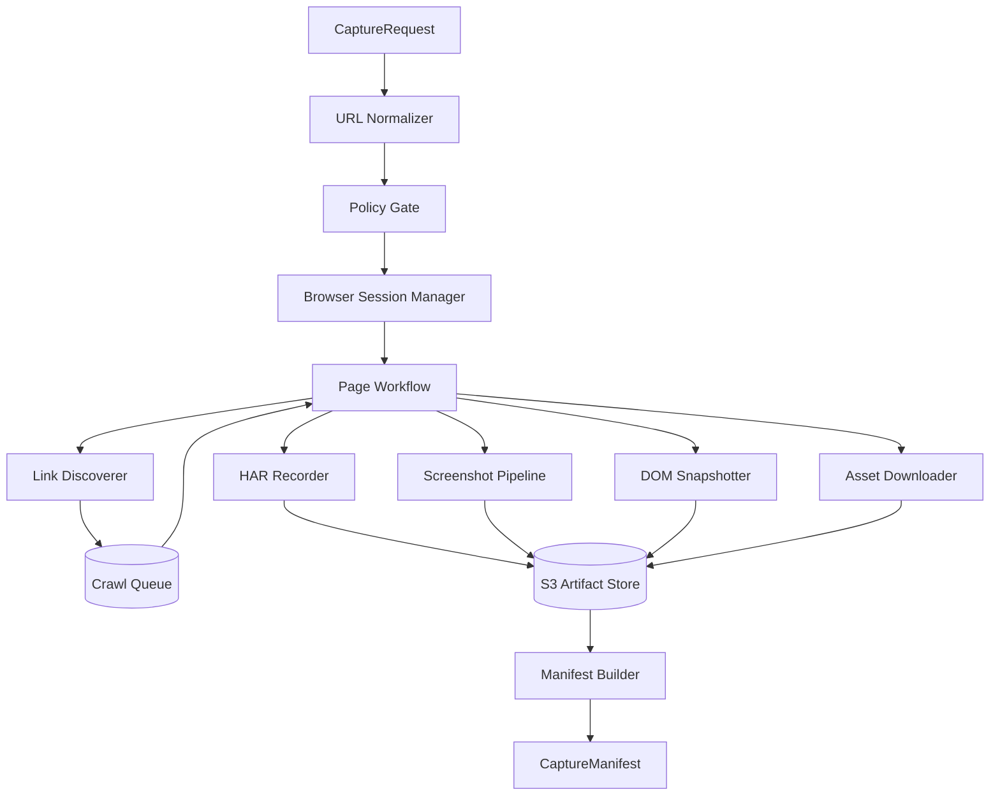

# 10 — Capture Engine

> The engine that turns a URL into a faithful, structured snapshot of a live website.

---

## Purpose

The Capture Engine is the platform's input adapter. It is responsible for fetching a source website with high fidelity and producing artifacts that downstream engines can analyze deterministically.

The engine must:

- Visit a URL with a real browser
- Faithfully record what the browser sees, including JavaScript-rendered content
- Discover and traverse internal links to a configurable depth
- Produce a manifest describing every page, asset, and request observed
- Operate within strict time, size, and ethical bounds

It must not:

- Bypass authentication
- Ignore `robots.txt`
- Exfiltrate captured content beyond the platform
- Pretend to have captured content it did not capture

---

## Scope

In scope:

- The internal architecture of capture
- The browser pool
- HAR recording
- Screenshot strategy
- Crawl strategy and link discovery
- Asset handling
- Output manifest format
- Failure modes

Out of scope:

- Content interpretation (`11-analysis-engine.md`)
- Code generation (`12-generation-engine.md`)
- Browser pool deployment topology (`02-system-architecture.md`)

---

## Engine Architecture



---

## Component Catalogue

### URL Normalizer

- Strips fragments and tracking parameters.
- Resolves the canonical host (`https://`, `https://www.`, `http://`).
- Lowercases the host.
- Honors HSTS preload list.

### Policy Gate

- Resolves DNS, refuses RFC 1918 and other private ranges.
- Checks denylist (`config/domain_denylist.yaml`).
- Checks tenant quota.
- Honors `robots.txt`: refuses to capture if root is disallowed; respects per-path rules during crawl.

### Browser Session Manager

- Maintains a pool of warm browser contexts.
- Each capture request leases one context.
- Contexts are isolated (separate profile, separate cookies).
- Pool size is configurable; default 1 context per worker.
- Browser is Chromium (primary); Firefox and WebKit available for compatibility passes.

### Page Workflow

For each page:

1. Navigate with `wait_until="networkidle"` and a hard 10-second cap.
2. Wait for hydration heuristics (no DOM mutations for 500 ms).
3. Capture HAR using Playwright's `record_har_path`.
4. Capture desktop screenshot (full page, 1440×900 viewport).
5. Switch context to mobile (390×844, DPR 3), capture mobile screenshot.
6. Snapshot DOM (`document.documentElement.outerHTML`).
7. Extract assets referenced by the DOM and the HAR.
8. Extract internal links.
9. Push internal links onto the crawl queue if within depth.

### HAR Recorder

- One HAR file per page.
- Body recording configured to include text/html, text/css, application/javascript, application/json, and SVG.
- Binary bodies referenced by URL only.
- Maximum HAR size per page: 25 MB. Larger captures are truncated with a warning.

### Screenshot Pipeline

- PNG by default, optimized via `oxipng` post-processing.
- Full-page; not viewport-only.
- One desktop and one mobile screenshot per page.
- Compressed and stored with deterministic filenames: `{page_id}_{viewport}.png`.

### DOM Snapshotter

- Serializes the post-hydration DOM.
- Removes inline `<script>` content but preserves attributes for analysis.
- Stores as `{page_id}.html`.

### Link Discoverer

- Extracts links from `<a href>` in the rendered DOM.
- Resolves relative links to absolute.
- Filters: same-origin only by default; configurable.
- Excludes mailto, tel, javascript, and download-attribute links.
- Hashes link target to deduplicate.

### Crawl Queue

- In-process priority queue.
- Priority: root (0), nav links (1), depth-N (N+1).
- Bounded by `max_pages` from the request.
- Skips already-visited URLs.

### Asset Downloader

- Downloads referenced images, fonts, videos (up to a per-asset size cap of 20 MB).
- Stores under `{job_id}/capture/assets/{sha256}.{ext}`.
- Records a manifest mapping URL → S3 URI.

### Manifest Builder

- Aggregates per-page outputs into a single `CaptureManifest`.
- Validates against the v1 schema.
- Writes to S3 and creates an `artifacts` row.

---

## Output: `CaptureManifest`

Schema (Pydantic v2):

```python
class CapturedAsset(BaseModel):
    url: HttpUrl
    s3_uri: str
    sha256: str
    size_bytes: int
    content_type: str
    referenced_by: list[str]  # page_ids

class CapturedPage(BaseModel):
    page_id: str               # uuid7
    url: HttpUrl
    canonical_url: HttpUrl | None
    title: str | None
    status: int                # HTTP status of navigation
    depth: int
    captured_at: datetime
    har_uri: str
    dom_uri: str
    screenshots: dict[str, str]   # viewport -> s3 uri
    links_outbound: list[HttpUrl]
    warnings: list[str]

class CaptureManifest(BaseModel):
    job_id: UUID
    root_url: HttpUrl
    canonical_root_url: HttpUrl
    pages: list[CapturedPage]
    assets: list[CapturedAsset]
    captured_at: datetime
    capture_duration_ms: int
    config: dict
    schema_version: Literal["1.0.0"]
    warnings: list[str]
```

S3 layout for one job:

```
s3://vibe-artifacts/{tenant_id}/{job_id}/capture/
├── manifest.json
├── pages/
│   ├── {page_id}.html
│   ├── {page_id}.har
│   ├── {page_id}_desktop.png
│   └── {page_id}_mobile.png
└── assets/
    ├── {sha256}.png
    ├── {sha256}.jpg
    └── ...
```

---

## Algorithms

### Hydration-Aware Wait

```python
async def wait_for_stable_dom(page: Page, max_wait_ms: int = 10000) -> None:
    start = monotonic()
    last_mutation = monotonic()
    async def on_mutation(_event):
        nonlocal last_mutation
        last_mutation = monotonic()
    await page.evaluate("""() => {
        const obs = new MutationObserver(() => window.__vibe_mutation = Date.now());
        obs.observe(document, { subtree: true, childList: true, attributes: true, characterData: true });
    }""")
    while (monotonic() - start) * 1000 < max_wait_ms:
        last = await page.evaluate("window.__vibe_mutation || 0")
        if last and (time.time() * 1000 - last) > 500:
            return
        await asyncio.sleep(0.1)
```

### Depth-First Bounded Crawl

```python
async def crawl(root_url: str, depth_limit: int, max_pages: int) -> list[CapturedPage]:
    queue = [(root_url, 0)]
    visited: set[str] = set()
    pages: list[CapturedPage] = []
    while queue and len(pages) < max_pages:
        url, depth = queue.pop()
        if url in visited:
            continue
        visited.add(url)
        page = await capture_page(url, depth)
        pages.append(page)
        if depth < depth_limit:
            for link in page.links_outbound:
                if same_origin(link, root_url) and link not in visited:
                    queue.append((link, depth + 1))
    return pages
```

### Bot-Wall Detector

Signals (any combination):

- Page title matches /access denied|just a moment|attention required/i
- DOM contains `cf-challenge` or `g-recaptcha` selector
- HTTP status 403 with `Server: cloudflare` and CF challenge body
- Less than 200 chars of textual content after hydration

If detected, the job aborts with `capture_blocked_bot_wall`.

---

## Configuration

```yaml
capture:
  default_crawl_depth: 2
  default_max_pages: 25
  hard_max_pages: 500
  per_page_timeout_ms: 30000
  per_job_timeout_ms: 900000  # 15 minutes
  hydration_wait_ms: 500
  max_har_bytes_per_page: 26214400  # 25 MB
  max_asset_bytes: 20971520  # 20 MB
  viewports:
    desktop: { width: 1440, height: 900, device_scale_factor: 1 }
    mobile:  { width: 390, height: 844, device_scale_factor: 3 }
  user_agent: "VibeBot/1.0 (+https://vibe.dev/bot)"
  respect_robots_txt: true
  honor_canonical: true
```

---

## Failure Mode Matrix

| Failure | Detection | Status Code | Recovery |
|---------|-----------|-------------|----------|
| DNS failure | `getaddrinfo` exception | `capture_failed_dns` | None. Customer error. |
| Connection refused | Playwright network error | `capture_failed_unreachable` | None. |
| Robots disallow on root | robots.txt parse | `capture_blocked_by_robots` | None. |
| Captcha / bot wall | Heuristic detector | `capture_blocked_bot_wall` | None. Operator review. |
| Page-level timeout | 30s navigation timeout | warning, continue | Next page. |
| Page-level 5xx | HTTP status | warning, continue | Next page. |
| Asset download failure | HTTP error | warning, continue | Referenced URL kept. |
| HAR size exceeded | byte cap | truncate, warning | Continue. |
| Browser crash | Process exit code | retry once | Restart pool. |
| Out of memory | OOMKilled | retry once with reduced concurrency | Workflow-level. |
| Job timeout | Job-level timer | `capture_timeout` | Manual rerun. |

---

## Performance Targets

| Metric | Target | Source |
|--------|--------|--------|
| Pages per minute per worker | ≥ 10 | NFR-PERF-009 |
| p95 per-page latency | ≤ 6 s | NFR-PERF-009 |
| Worker memory ceiling | ≤ 2 GB | Capacity |
| Browser pool warm-up | ≤ 10 s | Operational |

---

## Browser Pool Strategy

- **Warm pool:** workers keep N browser contexts warm to amortize startup. Default N=1 per worker, scaling vertically for high-throughput tiers.
- **Eviction:** contexts are evicted after 30 minutes or 50 captures, whichever first.
- **Isolation:** contexts are created with fresh storage state per capture; no cookie reuse across tenants.
- **Headers:** the bot's `User-Agent` is constant; `Accept-Language` defaults to `en-US,en;q=0.9` but is overridable per request.

---

## Ethics & Compliance

- The bot identifies itself with a recognizable `User-Agent`, a `From:` header containing `bot@vibe.dev`, and a documented IP range (V3).
- The bot honors `Crawl-delay` if present in `robots.txt`.
- The bot rate-limits itself to ≤ 2 concurrent requests against any single origin.
- The bot does not attempt to bypass paywalls, login walls, or bot-protection systems.

---

## Multi-Language Capture (V2+)

- The crawler follows `hreflang` annotations to discover locale-specific pages.
- Each captured page records its locale in the manifest.
- The user agent's `Accept-Language` is rotated per locale during crawl.

---

## Authenticated Capture (V3)

Opt-in only; off by default.

- Customers provide credentials via a secure intake flow (encrypted, single-use).
- The capture worker performs login via a tenant-supplied recipe (a small DSL that describes form selectors and steps).
- Authentication cookies are scoped to the capture context and shredded at end of capture.
- The capture refuses to traverse pages that contain payment data, password reset flows, or admin panels (heuristic).

---

## Observability

Each capture emits:

- A span `capture.run` with attributes `job_id`, `tenant_id`, `pages_captured`, `pages_failed`, `total_bytes`, `duration_ms`.
- A child span per page: `capture.page` with `url`, `status`, `duration_ms`, `har_bytes`.
- Counter metrics `vibe.capture.pages_total`, `vibe.capture.failures_total{reason}`.
- Histogram metrics `vibe.capture.page_latency_ms`, `vibe.capture.har_bytes`.

See `18-observability.md`.

---

## Cost Model

| Cost driver | Magnitude (per job) |
|-------------|---------------------|
| Compute (Fargate browser) | $0.10–0.25 |
| Egress (asset download) | $0.00–0.05 |
| S3 PUT requests | $0.001 |
| S3 storage (first 90 days) | $0.01 |

Target total: ≤ $0.25 per job at MVP scale.

---

## Testing Strategy

- **Unit:** URL normalization, robots parsing, link discovery, deduplication, hydration wait.
- **Integration:** capture against a fixture site served from a local container.
- **E2E:** capture against a small set of real, agreed-to sites in a "site zoo" (publicly hosted in a partner account).
- **Property-based:** crawl over generated fixture sites with random graphs to verify termination and bounds.
- **Chaos:** random network failures, slow responses, partial HTML.

See `19-testing-strategy.md`.

---

## Assumptions

- Chromium is sufficient for ≥ 95% of MVP target sites.
- The platform may operate as `VibeBot` without being misidentified as a generic crawler.
- 15-minute hard cap per job is acceptable for MVP.

---

## Design Decisions

| Decision | Rationale |
|----------|-----------|
| Playwright over Puppeteer/Selenium | Async Python, multi-browser, HAR built-in. |
| Per-page HAR | Easier downstream analysis than one giant HAR. |
| Full-page screenshots | Required for analysis context, not only above-the-fold. |
| Hydration-aware wait | Captures SPA content reliably. |
| Same-origin crawl by default | Stays within the customer's intent. |
| 25 MB HAR cap | Prevents pathological assets from blowing up storage. |
| Bot-identification headers | Ethical operation, easier whitelisting. |

---

## Open Questions

- Should we render with a head, off-screen, for sites that detect headless mode?
- Should the bot opt into a public IP range with reverse-DNS for whitelisting?
- Should we support sitemap-driven crawl as an alternative to link discovery?
- Should authenticated capture be hidden behind a separate product tier?

---

## Future Enhancements

- Visual regression vs. previously captured snapshots for the maintenance subscription.
- Differential capture: only fetch pages whose `Last-Modified` changed.
- A "deep capture" mode that exercises forms with synthetic submissions (read-only validation).
- Caching of repeated assets across jobs of the same tenant.

---

## Cross-References

- Downstream → `11-analysis-engine.md`
- Schema → `08-database-design.md` (`artifacts`, `agent_runs`)
- Architecture → `02-system-architecture.md`
- ADR-003 → `ADR/ADR-003-playwright.md`
