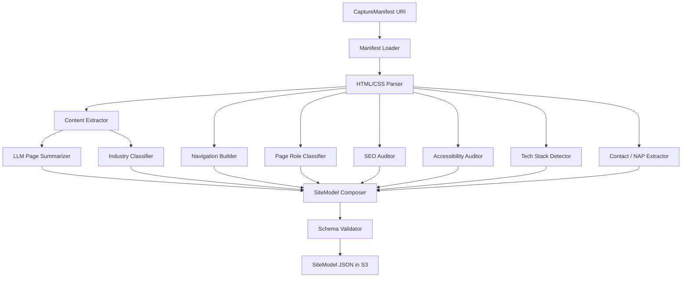

# 11 — Analysis Engine

> The engine that converts a captured snapshot into a normalized, structured model of the website.

---

## Purpose

The Analysis Engine takes a `CaptureManifest` and produces a `SiteModel`: a typed, schema-versioned representation of the site that downstream engines (Generation, SEO) consume.

The `SiteModel` is the platform's stable internal representation. It is the only contract that the Generation Engine reads. Every change to the `SiteModel` schema is a versioned event that requires migration of dependents.

---

## Scope

In scope:

- Internal architecture of analysis
- The `SiteModel` schema
- The page-role classifier
- The navigation graph
- The content extractor
- The SEO auditor
- The accessibility auditor
- The industry classifier
- LLM use within analysis
- Failure modes

Out of scope:

- Capture details (`10-capture-engine.md`)
- Generation use of the `SiteModel` (`12-generation-engine.md`)
- SEO enrichment of generated output (`13-seo-engine.md`)

---

## Engine Architecture



---

## Component Catalogue

### Manifest Loader

- Streams the manifest from S3.
- Lazy-loads page HTML and HAR on demand.
- Caches parsed HTML in memory for the duration of the analysis run.

### HTML/CSS Parser

- BeautifulSoup4 with `lxml` backend for HTML.
- `tinycss2` for CSS parsing where palette or font extraction is needed.
- Normalizes whitespace, removes comments, strips inline scripts.

### Content Extractor

For each captured page:

- Walks the DOM in document order.
- Emits a flat list of `ContentBlock`s: heading, paragraph, list, table, image, embed, form, callout.
- Preserves heading hierarchy (`h1`–`h6`) as a tree.
- Detects "main content" using readability heuristics (Readability.js port) when navigation/footer noise is heavy.

### Navigation Builder

- Identifies the primary navigation by:
  - `<nav>` landmarks
  - High-density link clusters near the top of the page
  - Repeated across pages (consensus)
- Identifies footer navigation similarly.
- Builds a graph: nodes are pages, edges are links (typed: nav, footer, content).
- Detects strongly connected components.
- Picks a canonical home page (root URL after canonicalization).

### Page Role Classifier

Roles (initial set):

- `home`
- `about`
- `services`
- `service_detail`
- `products`
- `product_detail`
- `pricing`
- `contact`
- `blog_index`
- `blog_post`
- `gallery`
- `team`
- `careers`
- `legal` (privacy, terms)
- `faq`
- `testimonials`
- `case_study`
- `landing`
- `generic`

Approach:

- Rules first (URL pattern, title heuristics, anchor text).
- LLM tiebreaker only for low-confidence cases (configurable threshold).

### SEO Auditor

Per-page checks (each producing a finding with a severity):

- Title present, length 30–60 chars, unique
- Meta description present, length 50–160 chars
- Canonical link present and consistent
- `lang` attribute on `<html>`
- Open Graph minimum set (`og:title`, `og:description`, `og:image`, `og:url`)
- Twitter card present
- One `h1` per page
- Heading hierarchy intact
- All images have `alt`
- Internal link integrity (no broken)
- `robots` meta not blocking unintentionally
- Structured data present
- Mobile viewport meta
- HTTPS only

Severities: `critical`, `serious`, `moderate`, `minor`, `info`.

### Accessibility Auditor

- Runs `axe-core` rules against captured DOM via a headless Chromium invocation.
- Filters out rules irrelevant to a static capture (e.g., focus-related rules tested separately).
- Emits findings keyed by `rule_id`, `selector`, `severity`, `description`.

### Tech Stack Detector

- Looks for known fingerprints in HTML, HTTP headers, and HAR.
- Identifies CMS (WordPress, Squarespace, Wix, Webflow, Drupal, Shopify), framework (React, Vue, Angular, jQuery), analytics, ad networks, fonts (Google Fonts, Adobe Fonts).
- Wappalyzer fingerprints are the baseline; we maintain our own list under `apps/analysis/fingerprints/`.

### NAP Extractor

- Phones: regex over visible text, normalized to E.164 (using `phonenumbers`).
- Emails: regex with TLD validation.
- Addresses: heuristic + `usaddress` (US-first), with a fallback LLM extraction for international.
- Hours: parser handling common formats ("Mon–Fri 9–5", "Open 24/7", JSON-LD `openingHours`).

### LLM Page Summarizer

- For each page above a content-length threshold, produces:
  - A one-paragraph summary (≤ 80 words)
  - A list of 3–7 keywords / topics
  - A suggested meta description (≤ 160 chars)
- Prompts live under `apps/analysis/prompts/summarize_page.md`.
- Token budget: capped per page; aggregate cost guard at engine level.

### Industry Classifier

- LLM classifier with a fixed taxonomy (NAICS-derived, simplified to ~80 categories).
- Returns label and confidence.
- Below 0.6 confidence: falls back to `general`.

### SiteModel Composer

- Combines all upstream outputs.
- Resolves conflicts deterministically (e.g., LLM summary preferred over scraped meta).
- Stamps `schema_version`.
- Writes to S3.

### Schema Validator

- Validates the composed model against the Pydantic schema before write.
- Failures abort the engine with `analysis_invalid_output`.

---

## Output: `SiteModel` (Schema v1)

```python
class Locale(BaseModel):
    code: str           # "en", "es"
    region: str | None  # "US", "MX"

class ContentBlock(BaseModel):
    kind: Literal["heading", "paragraph", "list", "table", "image", "embed", "form", "callout", "quote"]
    level: int | None             # for headings
    text: str | None
    items: list["ContentBlock"] = []
    src: str | None               # image / embed
    alt: str | None
    metadata: dict = {}

class PageModel(BaseModel):
    id: str
    url: HttpUrl
    canonical_url: HttpUrl | None
    role: str                     # see role list
    role_confidence: float
    title: str | None
    meta_description: str | None
    summary: str | None           # LLM-generated
    keywords: list[str] = []
    locale: Locale
    blocks: list[ContentBlock]
    seo_findings: list[SeoFinding]
    a11y_findings: list[A11yFinding]
    references: list[HttpUrl]     # outgoing links

class NavItem(BaseModel):
    label: str
    target: HttpUrl
    children: list["NavItem"] = []

class NavigationGraph(BaseModel):
    primary: list[NavItem]
    footer: list[NavItem]
    edges: list[tuple[str, str, Literal["nav", "footer", "content"]]]

class NAP(BaseModel):
    phones: list[str] = []
    emails: list[str] = []
    addresses: list[Address] = []
    hours: list[HoursSpec] = []

class SeoAudit(BaseModel):
    findings: list[SeoFinding]
    score: int       # 0..100 estimate from rules

class AccessibilityAudit(BaseModel):
    findings: list[A11yFinding]
    score: int       # 0..100 estimate

class TechStack(BaseModel):
    cms: str | None
    frameworks: list[str] = []
    analytics: list[str] = []
    ads: list[str] = []
    fonts: list[str] = []

class SiteModel(BaseModel):
    job_id: UUID
    site_name: str | None
    industry: str
    industry_confidence: float
    locale: Locale
    pages: list[PageModel]
    navigation: NavigationGraph
    nap: NAP
    seo_audit: SeoAudit
    a11y_audit: AccessibilityAudit
    tech: TechStack
    palette: list[str] = []           # extracted hex colors
    fonts: list[str] = []             # extracted font families
    images: list[AssetRecord]
    summary_paragraph: str
    schema_version: Literal["1.0.0"]
```

---

## Algorithms

### Heading-Tree Reconstruction

```python
def build_heading_tree(blocks: list[ContentBlock]) -> Tree:
    root = Tree.root()
    stack = [(0, root)]
    for b in blocks:
        if b.kind != "heading":
            stack[-1][1].add_block(b)
            continue
        while stack and stack[-1][0] >= b.level:
            stack.pop()
        node = stack[-1][1].add_heading(b)
        stack.append((b.level, node))
    return root
```

### Navigation Consensus

```python
def detect_primary_nav(pages: list[ParsedPage]) -> list[NavItem]:
    candidate_groups = []
    for p in pages:
        groups = extract_nav_candidates(p.dom)  # <nav>, top link clusters
        for g in groups:
            candidate_groups.append(canonicalize(g))
    counter = Counter(candidate_groups)
    best, count = counter.most_common(1)[0]
    if count >= max(2, 0.6 * len(pages)):
        return parse_group(best)
    # fallback to home page's <nav>
    return extract_first_nav(pages[0].dom)
```

### Page Role Classification (Rules-First)

```python
RULES: list[tuple[str, str]] = [
    (r"^/?$", "home"),
    (r"/(about|about-us|our-story)/?$", "about"),
    (r"/(services|what-we-do)/?$", "services"),
    (r"/(services|what-we-do)/[^/]+/?$", "service_detail"),
    (r"/(blog|news|articles)/?$", "blog_index"),
    (r"/(blog|news|articles)/[^/]+/?$", "blog_post"),
    (r"/(contact|contact-us|reach-us)/?$", "contact"),
    (r"/(privacy|terms|legal)/?$", "legal"),
    (r"/(pricing|plans)/?$", "pricing"),
    (r"/(faq|frequently-asked)/?$", "faq"),
]

def classify_role(page: PageModel) -> tuple[str, float]:
    for pat, role in RULES:
        if re.search(pat, page.url.path, re.I):
            return role, 0.95
    # title heuristics
    t = (page.title or "").lower()
    if "about" in t: return "about", 0.7
    # LLM tiebreaker for ambiguous cases
    return llm_classify_role(page), 0.6
```

### LLM Cost Control

- Pages above 5,000 characters of body text are summarized.
- The summarizer is called at most once per page.
- Aggregate token budget per analysis: 50k input + 10k output.
- Overruns trigger truncation with a warning.

---

## Configuration

```yaml
analysis:
  llm:
    primary: openai/gpt-4o-mini
    fallback: anthropic/claude-3-5-sonnet
    temperature: 0.2
    max_tokens_per_page: 1200
    max_tokens_per_analysis: 60000
  industry_classification:
    confidence_floor: 0.6
  page_role:
    use_llm_tiebreaker_below_confidence: 0.85
  axe:
    rules_disabled:
      - focus-order-semantics
      - color-contrast-enhanced
  output:
    schema_version: "1.0.0"
```

---

## Failure Mode Matrix

| Failure | Detection | Status | Recovery |
|---------|-----------|--------|----------|
| Manifest URI invalid | S3 404 | `analysis_missing_input` | None. |
| Capture has zero pages | Manifest pages empty | `analysis_no_pages` | None. |
| LLM provider unavailable | API error after retries | failover | Anthropic fallback. |
| LLM cost overrun | Token guard | warning, truncate | Continue. |
| Invalid output | Schema validation | `analysis_invalid_output` | Retry once. |
| Industry classification low confidence | < 0.6 | `general` industry | Continue. |
| axe-core crash | Subprocess error | warning, partial audit | Continue. |

---

## Performance Targets

| Metric | Target |
|--------|--------|
| Analysis duration (10 pages) | ≤ 90 s p95 |
| LLM cost per analysis | ≤ $0.60 |
| Memory ceiling | ≤ 1.5 GB |

---

## Quality Assurance Within Analysis

The `SiteModel` is graded internally before write:

- Coverage: ≥ 90% of captured pages classified to a non-`generic` role.
- Content fidelity: ≥ 95% of captured headings present.
- Internal link integrity: 100% of internal links resolve to a page or are flagged.

Failure of these grades does not block the engine but is surfaced as `warnings` in the model.

---

## Observability

- Span `analysis.run` with `pages`, `tokens_in`, `tokens_out`, `cost_usd`, `industry`, `warnings_count`.
- Counter `vibe.analysis.pages_analyzed_total`.
- Histogram `vibe.analysis.duration_ms`.
- LLM token counts attributed per agent call via OpenTelemetry GenAI semantic conventions.

---

## LLM Prompting

Each LLM-using step has:

- A prompt template under `apps/analysis/prompts/<purpose>.md`.
- A prompt version constant included in the prompt header.
- A regression suite (golden inputs and outputs) under `apps/analysis/tests/prompts/`.
- A cost target documented in the template's frontmatter.

Example header:

```markdown
---
purpose: summarize_page
version: 1.2.0
model_preference: gpt-4o-mini
max_tokens: 400
temperature: 0.2
cost_target_usd: 0.001
---
```

Prompts are version-controlled and PR-reviewed. Prompt changes that affect golden outputs require updated goldens with reviewer sign-off.

---

## Testing Strategy

- **Unit:** parser correctness, rules-based role classification, heading tree.
- **Snapshot:** known fixture sites produce known `SiteModel` outputs.
- **Property-based:** randomized DOMs do not crash; outputs always validate.
- **LLM golden tests:** stable prompts produce stable outputs within a tolerance.
- **Integration:** end-to-end from a real capture to a `SiteModel`.

See `19-testing-strategy.md`.

---

## Assumptions

- The capture engine produces well-formed HTML in the DOM snapshot.
- LLM providers remain available with token costs in line with `28-cost-model.md`.
- The industry taxonomy is sufficient for ≥ 95% of MVP target customers.

---

## Design Decisions

| Decision | Rationale |
|----------|-----------|
| `SiteModel` as a stable, versioned schema | Decouples capture and generation. |
| Rules-first, LLM-tiebreaker classification | Predictable, cost-effective, debuggable. |
| Per-page summaries cached and reused | Avoids redundant LLM cost in SEO engine. |
| axe-core for accessibility | Industry-standard rule set. |
| Wappalyzer fingerprints + internal extensions | Pragmatic detection. |

---

## Open Questions

- Should we adopt a graph database for the navigation graph at V3 scale?
- Should the industry taxonomy be customer-customizable for white-label?
- Should we run an LLM critic on the produced `SiteModel` to surface gaps?

---

## Future Enhancements

- Visual analysis from screenshots (image-to-layout LLM) to recover lost structure.
- Multi-pass refinement: a critic re-reads the `SiteModel` and proposes corrections.
- Cross-page de-duplication (boilerplate factoring) at the schema level.
- Per-industry custom auditors (e.g., for restaurants: detect menu presence).

---

## Cross-References

- Upstream → `10-capture-engine.md`
- Downstream → `12-generation-engine.md`
- Schema versioning → `08-database-design.md`
- LLM cost → `28-cost-model.md`
