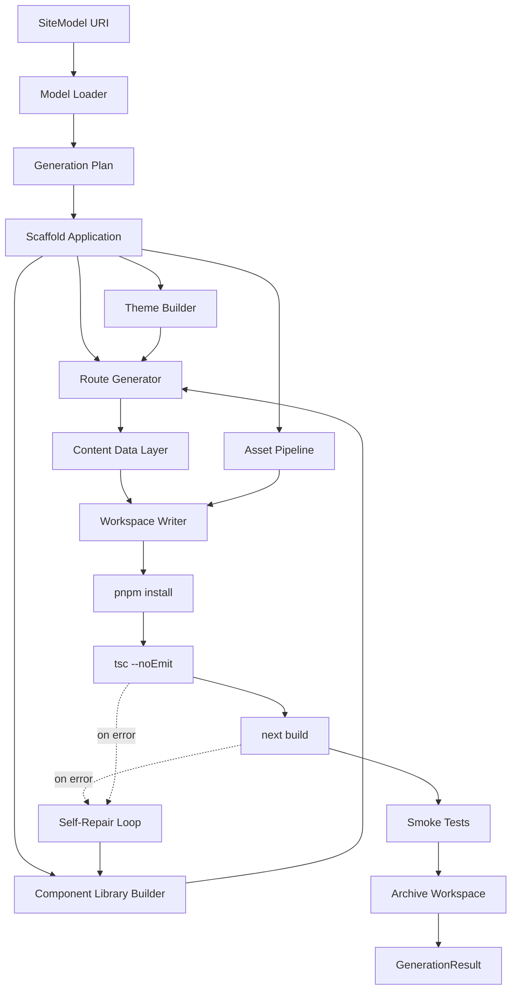

# 12 — Generation Engine

> The engine that turns a `SiteModel` into a buildable, production-quality Next.js application.

---

## Purpose

The Generation Engine is the heart of the platform. It takes the structured `SiteModel` produced by Analysis and synthesizes a buildable Next.js application that:

- Reproduces the source site's information architecture
- Improves accessibility and SEO
- Achieves Lighthouse Performance ≥ 90 on mobile
- Builds with zero errors on the first attempt (or self-repairs)
- Compiles to TypeScript with no type errors
- Is buildable by any developer with no prior context

It must not:

- Invent content that does not exist on the source site
- Drop content that exists on the source site (without justification)
- Hardcode platform-specific identifiers in customer-visible places
- Produce code that depends on Vibe runtime services

---

## Scope

In scope:

- The generation pipeline
- The template registry
- The component synthesis strategy (deterministic + LLM)
- The Tailwind theming
- The asset pipeline
- The build and self-repair loop
- The output workspace structure
- Failure modes

Out of scope:

- SEO enrichment (`13-seo-engine.md`)
- Deployment to GitHub or Vercel (`14-deployment-engine.md`)
- Capture or analysis (`10`, `11`)

---

## Engine Architecture



---

## Component Catalogue

### Model Loader

- Streams the `SiteModel` JSON from S3.
- Validates against the v1 Pydantic schema.
- Rejects unknown major schema versions.

### Generation Plan

A `GenerationPlan` is an explicit, JSON-serializable artifact that describes what will be generated. It is created up front so:

- The plan can be inspected and audited.
- The plan can be regenerated deterministically.
- Failures can be diagnosed against the plan.

```python
class GenerationPlan(BaseModel):
    template: str                       # "default", "restaurant", "consulting", ...
    routes: list[RoutePlan]
    components: list[ComponentSpec]
    theme: ThemePlan
    assets: list[AssetPlan]
    layout: LayoutPlan
    metadata: dict
```

### Scaffold Application

- Writes a minimal Next.js 14 (App Router) skeleton:
  - `app/layout.tsx`
  - `app/page.tsx`
  - `app/globals.css`
  - `next.config.mjs`
  - `tsconfig.json`
  - `package.json` with pinned dependency versions
  - `pnpm-lock.yaml` (generated by `pnpm install`)
  - `.gitignore`
  - `README.md`
  - `LICENSE`
- Configures Tailwind, ESLint, Prettier.

### Theme Builder

- Inputs: extracted `palette` and `fonts` from the `SiteModel`.
- Outputs: a `tailwind.config.ts` with:
  - `theme.colors.brand` and accessibility-checked variants
  - `theme.fontFamily.sans` and `theme.fontFamily.heading`
  - Container sizes and breakpoints
- Validates color contrast for primary text-on-background combinations; substitutes safe defaults if AA contrast fails.

### Component Library Builder

For each commonly needed UI primitive, the engine selects from a curated, deterministic component library shipped with the engine (`packages/generation-components`). Components include:

- `Header`, `Footer`, `Container`, `Section`
- `Hero`, `FeatureGrid`, `CallToAction`, `Testimonials`, `FAQ`
- `ContactBlock`, `Map`, `BusinessHours`
- `PostList`, `PostCard`, `PostBody`
- `Gallery`, `ImageWithCaption`
- `Form`, `FormField`

The library is hand-authored, accessibility-audited, and version-pinned. The engine prefers library components over LLM-synthesized ones. LLM synthesis is reserved for genuinely novel composition not satisfied by the library (rare).

### Route Generator

For each `PageModel` in the `SiteModel`:

1. Determine the Next.js route path (preserving the source path).
2. Select a layout based on the page role.
3. Compose the page from library components, populated with the page's `ContentBlock`s.
4. Render with React Server Components by default; mark client components only when interactivity demands.

Pseudocode:

```python
def generate_route(page: PageModel, plan: GenerationPlan) -> RouteFile:
    layout = pick_layout(page.role)
    sections = []
    for block in page.blocks:
        section = render_block(block, plan.theme, plan.components)
        sections.append(section)
    body = layout.compose(sections, page)
    return RouteFile(path=f"app{page.url.path}/page.tsx", body=body)
```

### Content Data Layer

- Page content is stored as MDX or JSON under `content/` to keep generated TSX clean and human-editable.
- The platform default is JSON for structured blocks and MDX for long-form text.

Example output:

```
content/
├── home.json
├── about.json
├── services/
│   ├── index.json
│   ├── plumbing.json
│   └── water-heaters.json
└── blog/
    ├── 2024-01-hello-world.mdx
    └── 2024-02-spring-tips.mdx
```

Generated routes import this content. Customers can edit the content files without touching JSX.

### Asset Pipeline

- Downloads captured assets from S3.
- Optimizes images via `sharp`:
  - Converts to WebP and AVIF where supported.
  - Generates responsive size sets.
  - Emits content-hashed filenames.
- Places assets under `public/images/`, `public/fonts/`, etc.
- Records a mapping from source URL to local path.

### Workspace Writer

- Writes all generated files to a per-job temp directory: `/var/vibe/workspaces/{job_id}/`.
- Runs `pnpm install --frozen-lockfile` after writing `package.json`.
- Runs Prettier on all generated files.

### Type-check + Build

- `pnpm tsc --noEmit` first (catches errors fast).
- `pnpm next build` after.
- Output is collected; on success, archived as a tarball and uploaded to S3.

### Self-Repair Loop

The most important reliability mechanism. When type-check or build fails:

1. Collect the error and the offending file(s).
2. Construct a repair prompt:
   - The error message
   - The current file contents
   - The intended behavior from the `GenerationPlan`
3. Invoke the LLM with strict constraints:
   - Output a unified diff or the corrected file.
   - No changes outside the named file.
4. Apply the patch.
5. Rerun type-check and build.
6. Up to 3 attempts. On exhaustion, abort with `generation_self_repair_exhausted`.

Self-repair telemetry is recorded per attempt, including diff size and prompt cost.

### Smoke Tests

After a successful build:

- Run `playwright` against a `next start` server.
- Visit the home page and 2 random non-home pages.
- Assert that the navigation contains the expected items.
- Assert that the page renders without console errors.
- Assert that no broken `<a href>` returns 404 (against the local server).

Failures route back into self-repair.

### Archive Workspace

- Tarball (`.tar.zst`) the workspace excluding `node_modules` and `.next`.
- Upload to S3 with content hash.
- Record an `artifacts` row.

---

## Template System

A template is a curated bundle that biases generation toward a vertical:

```
packages/generation-templates/
├── default/
│   ├── manifest.yaml
│   ├── layouts/
│   ├── sections/
│   └── prompts/
├── restaurant/
├── consulting/
├── ecommerce/        # V2+
└── nonprofit/
```

Template `manifest.yaml`:

```yaml
id: restaurant
display_name: Restaurant
version: 1.0.0
applies_when:
  industries: [restaurant, cafe, bar, food_service]
layouts:
  home: layouts/home_with_menu.tsx
  menu: layouts/menu_page.tsx
component_overrides:
  Hero: sections/restaurant_hero.tsx
  ContactBlock: sections/restaurant_contact.tsx
prompts:
  meta_description: prompts/meta_restaurant.md
```

The engine selects a template based on the `SiteModel.industry`. If no match, `default` is used.

---

## Output Workspace Structure

```
{job_id}/workspace/
├── README.md
├── LICENSE
├── package.json
├── pnpm-lock.yaml
├── tsconfig.json
├── next.config.mjs
├── tailwind.config.ts
├── postcss.config.mjs
├── .eslintrc.cjs
├── .prettierrc
├── .gitignore
├── vercel.json
├── app/
│   ├── layout.tsx
│   ├── page.tsx               # home
│   ├── about/page.tsx
│   ├── services/
│   │   ├── page.tsx
│   │   └── [slug]/page.tsx
│   ├── blog/
│   │   ├── page.tsx
│   │   └── [slug]/page.tsx
│   ├── contact/page.tsx
│   ├── sitemap.ts
│   ├── robots.ts
│   ├── opengraph-image.tsx
│   └── llms.txt/route.ts
├── components/
│   ├── Header.tsx
│   ├── Footer.tsx
│   ├── Hero.tsx
│   ├── FeatureGrid.tsx
│   └── ...
├── content/
│   ├── home.json
│   ├── about.json
│   └── ...
├── lib/
│   ├── content.ts
│   └── seo.ts
└── public/
    ├── images/
    └── fonts/
```

---

## Determinism & Reproducibility

Goals:

- Given the same `SiteModel` and the same generation engine version, the workspace tarball should be byte-identical except for embedded timestamps.
- LLM outputs introduce nondeterminism by default. Mitigations:
  - `temperature=0`.
  - Seeded sampling where supported.
  - Self-repair recorded and replayed via prompt/output capture.
- Prettier and formatter passes normalize whitespace.

100% determinism is not promised; "deterministic enough to diff" is the goal.

---

## Configuration

```yaml
generation:
  node_version: "20"
  pnpm_version: "9"
  next_version: "14.2"
  tailwind_version: "3.4"
  typescript_version: "5.5"
  template_default: default
  self_repair:
    max_attempts: 3
    diff_size_limit_lines: 200
  build:
    timeout_seconds: 240
    memory_mb: 4096
  smoke_tests:
    pages_sampled: 3
    timeout_seconds: 60
  llm:
    primary: openai/gpt-4o
    fallback: anthropic/claude-3-5-sonnet
    max_tokens_per_attempt: 4000
    cost_envelope_usd: 1.80
```

---

## Failure Mode Matrix

| Failure | Detection | Status | Recovery |
|---------|-----------|--------|----------|
| Type error after self-repair | `tsc` non-zero | `generation_typecheck_failed` | Abort. |
| Build error after self-repair | `next build` non-zero | `generation_build_failed` | Abort. |
| Workspace > 1 GB | size check | `generation_oversized` | Abort. Operator review. |
| LLM cost overrun | guard | warning, simplify route | Continue. |
| Smoke test page 5xx | http check | self-repair | Up to 2 reruns. |
| Disk full | `OSError` | infra incident | Retry on healthy worker. |
| pnpm install fails | exit code | infra incident | Retry. |

---

## Performance Targets

| Metric | Target |
|--------|--------|
| Generation duration (10 pages) | ≤ 8 min p95 |
| Build time | ≤ 90 s p95 |
| First-attempt build success rate | ≥ 90% |
| Self-repair success rate (when triggered) | ≥ 95% |
| Lighthouse Performance (mobile) | ≥ 90 median |

---

## Cost Envelope

| Cost driver | Magnitude (per job) |
|-------------|---------------------|
| LLM (planning + self-repair) | $0.60–$1.50 |
| Compute (build) | $0.10–$0.30 |
| S3 storage (workspace archive) | $0.005 |

Target ≤ $1.80 per job.

---

## Quality Gates Inside Generation

Before declaring success:

1. `tsc --noEmit` passes.
2. `next build` succeeds.
3. `eslint .` passes (errors fail, warnings tolerated up to a threshold).
4. Smoke tests pass.
5. Pre-deploy Lighthouse run achieves Performance ≥ 85 on home page (final gate at QR engine).

Failures route back into self-repair before declaring engine failure.

---

## Observability

- Span `generation.run` with `routes`, `components`, `self_repair_attempts`, `build_duration_ms`, `cost_usd`.
- Counter `vibe.generation.routes_total`.
- Counter `vibe.generation.self_repair_total`.
- Histogram `vibe.generation.build_duration_ms`.
- LLM token attribution per repair attempt.

---

## Template Authoring (For Future Contributors)

To add a new template:

1. Create `packages/generation-templates/<id>/`.
2. Write `manifest.yaml` declaring applicability.
3. Author layouts and section overrides as plain `.tsx` (server-component-safe).
4. Provide prompts for any LLM-driven steps the template introduces.
5. Add a snapshot fixture under `apps/generation/tests/templates/<id>/`.
6. Update the template registry index.

Templates are reviewed for accessibility and performance before acceptance.

---

## Testing Strategy

- **Unit:** prompt rendering, plan generation, file writers.
- **Golden:** known `SiteModel` produces known workspace (allowing whitespace diff).
- **Integration:** real `SiteModel` → built workspace, asserting `next build` passes.
- **End-to-end:** real source URL → captured → analyzed → generated → built → smoke-tested.
- **Performance:** Lighthouse against the built output on a CI runner.

See `19-testing-strategy.md`.

---

## Assumptions

- Next.js 14 App Router is the only generation target through V2.
- Tailwind CSS is acceptable to customers; they can replace it if desired since source is delivered.
- Customers are willing to edit content via JSON/MDX for simple updates.
- LLM-driven self-repair is reliable enough to be a load-bearing mechanism.

---

## Design Decisions

| Decision | Rationale |
|----------|-----------|
| App Router (not Pages) | Modern, RSC-first, future-proof. |
| Curated component library + LLM synthesis | Maximizes determinism; LLM only where necessary. |
| Content in JSON/MDX, not embedded in TSX | Editable by humans without touching code. |
| Self-repair as a first-class mechanism | Bridges LLM unreliability without operator burden. |
| Per-template overrides | Improves vertical fit without forking the engine. |
| `tailwind.config.ts` derived from source palette | Preserves brand without manual theming. |
| pnpm + frozen lockfile | Reproducible installs. |

---

## Open Questions

- Should we generate Storybook stories for each component? (Useful for human handoff.)
- Should we offer Astro as an alternative target sooner than V3 for static-only sites?
- Should the engine produce a Cypress or Playwright test suite for the generated site?
- Should we offer a "preserve original CSS" mode for customers who want a closer visual match?

---

## Future Enhancements

- Visual-fidelity mode: generation guided by screenshots, not only content.
- Multi-template synthesis (combine sections from multiple templates).
- A learned component selector that uses production telemetry from delivered sites to improve choices.
- Static-export mode (Next.js `output: "export"`) for pure-static deployments.
- A CMS-friendly mode that wires content to an open-source headless CMS the customer can host.

---

## Cross-References

- Upstream → `11-analysis-engine.md`
- Downstream → `13-seo-engine.md`, `14-deployment-engine.md`
- Templates inventory → `packages/generation-templates/README.md` (when implemented)
