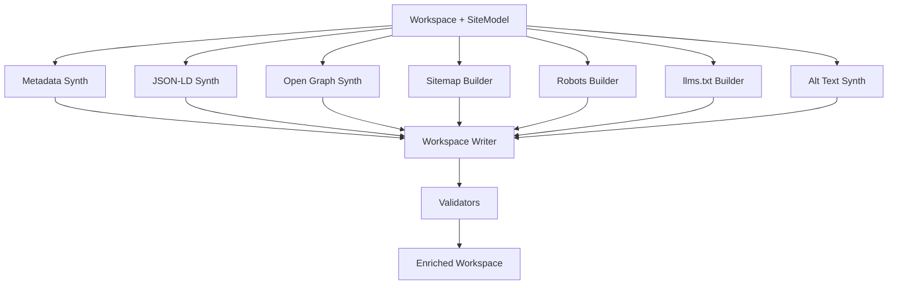

# 13 — SEO Engine

> The engine that enriches a generated workspace with the metadata, structured data, and discoverability artifacts that distinguish a modern site from a legacy one.

---

## Purpose

The SEO Engine sits between Generation and Quality Review. It takes a generated workspace and enriches it with everything that improves discoverability, both in legacy search engines and in modern AI assistants.

Its outputs are decisive in achieving the product's value proposition: customers do not buy a redesign, they buy discoverability.

---

## Scope

In scope:

- Metadata (titles, descriptions, canonicals)
- Structured data (Schema.org / JSON-LD)
- Sitemaps
- `robots.txt`
- Open Graph and Twitter cards
- `llms.txt` generation
- Per-page enhancements
- Validators and gates

Out of scope:

- Code generation (`12-generation-engine.md`)
- Quality Review beyond SEO-specific (`19-testing-strategy.md`)
- Continuous improvement of SEO over time (`29-future-vision.md`)

---

## Engine Architecture



---

## Component Catalogue

### Metadata Synth

For every route, produces:

- `<title>`: unique, 30–60 characters, derived from page summary + brand
- `<meta name="description">`: 50–160 characters, derived from page summary
- `<link rel="canonical">`: the absolute URL
- `<html lang="...">`: from the locale
- `<meta name="viewport" content="width=device-width, initial-scale=1">`
- `<meta name="theme-color">`: from theme

Implementation strategy: write Next.js `generateMetadata` exports per route.

Example:

```tsx
// app/services/plumbing/page.tsx
export async function generateMetadata(): Promise<Metadata> {
  return {
    title: "Plumbing Services — Acme HVAC of Austin",
    description: "24/7 plumbing repair and installation in Austin, TX...",
    alternates: { canonical: "https://acme.example/services/plumbing" },
    openGraph: { /* ... */ },
    twitter: { /* ... */ },
  };
}
```

### JSON-LD Synth

Per page, attach `application/ld+json`:

- Home / contact pages: `LocalBusiness` (or industry-specialized subtype)
- Articles / posts: `Article`
- Products: `Product` (V2 e-commerce mode)
- FAQ pages: `FAQPage`
- Service pages: `Service`
- Organization (sitewide via root layout)
- BreadcrumbList (for nested routes)

Example:

```json
{
  "@context": "https://schema.org",
  "@type": "Plumber",
  "name": "Acme HVAC",
  "url": "https://acme.example",
  "telephone": "+1-512-555-0100",
  "address": {
    "@type": "PostalAddress",
    "streetAddress": "123 Main St",
    "addressLocality": "Austin",
    "addressRegion": "TX",
    "postalCode": "78701",
    "addressCountry": "US"
  },
  "openingHoursSpecification": [
    { "@type": "OpeningHoursSpecification", "dayOfWeek": "Monday", "opens": "09:00", "closes": "17:00" }
  ],
  "areaServed": "Austin, TX"
}
```

The SEO engine ships JSON-LD as React Server Component output:

```tsx
<script type="application/ld+json" dangerouslySetInnerHTML={{ __html: JSON.stringify(jsonLd) }} />
```

### Open Graph Synth

Per page:

- `og:title`, `og:description`, `og:url`, `og:type`
- `og:image`: dynamically generated via `app/opengraph-image.tsx` (Next.js OG image API). Background, title, and brand mark composited deterministically.
- Twitter card metadata mirrors OG.

Image strategy:

- Default OG image: a templated card with the page title, the brand color, and a small logo.
- Customers can override via a per-page key in `content/`.

### Sitemap Builder

- Produces `app/sitemap.ts` exporting a function that returns the route list.
- Split into multiple sitemaps if URL count > 50,000.
- Includes `lastmod` based on content hash (stable for unchanged content).

```ts
import type { MetadataRoute } from "next";
import { routes } from "@/lib/routes";

export default function sitemap(): MetadataRoute.Sitemap {
  return routes.map(r => ({
    url: r.absoluteUrl,
    lastModified: r.lastModified,
    changeFrequency: r.changeFrequency,
    priority: r.priority,
  }));
}
```

### Robots Builder

- Produces `app/robots.ts` referencing the sitemap.
- Defaults to allow-all.
- Per-tenant overrides possible (e.g., disallow staging routes).

### llms.txt Builder

`/llms.txt` is the platform's primary AI-discoverability artifact, intended for AI assistants per the emerging `llms.txt` convention (https://llmstxt.org).

Format:

```
# Acme HVAC of Austin

> Family-owned HVAC and plumbing services serving Austin, TX since 1986.
> 24/7 emergency dispatch. Licensed and insured.

## Pages

- [Home](https://acme.example/): Overview of services and service area.
- [About](https://acme.example/about/): Company history and team.
- [Services](https://acme.example/services/): Full list of HVAC and plumbing services.
- [Plumbing](https://acme.example/services/plumbing/): 24/7 plumbing repair, installation, and inspection.
- [Heating](https://acme.example/services/heating/): Furnace and heat pump installation, repair, maintenance.
- [Contact](https://acme.example/contact/): Phone, email, address, and online booking.

## Contact

- Phone: +1-512-555-0100
- Email: hello@acme.example
- Address: 123 Main St, Austin, TX 78701
- Hours: Mon–Fri 9–5, Sat 9–1, emergency 24/7

## Service Area

Austin, TX and surrounding cities within 30 miles.
```

Implementation: `app/llms.txt/route.ts` returns the file with `text/plain; charset=utf-8` and a `Cache-Control: public, max-age=3600`.

The content is composed from:

- `SiteModel.summary_paragraph` (lead)
- `SiteModel.pages` (page list with one-line descriptions from `PageModel.summary`)
- `SiteModel.nap` (contact)
- Optionally, an `llms-full.txt` companion with full page content for AI training-friendly contexts (opt-in per tier).

### Alt-Text Synth

- Every image in the generated workspace has an `alt` attribute.
- Source `alt` is preserved when present and non-trivial.
- LLM generates alt text when source is missing or trivial ("image", "img", filename).
- Decorative images are explicitly `alt=""`.

### Validators

After all writers, the SEO engine validates:

| Validator | Action on failure |
|-----------|-------------------|
| JSON-LD parses and validates against Schema.org base spec | Drop invalid block, warn |
| Title length 30–60 | Re-truncate or extend, deterministic algorithm |
| Description length 50–160 | Re-truncate, append safe filler if needed |
| Sitemap parses | Abort engine; corrupt sitemap is unacceptable |
| Robots parses | Abort engine |
| llms.txt < 2 MB | Truncate page list, warn |
| Canonical URLs absolute | Abort engine |
| All images have `alt` attribute (even if empty) | Generate or set decorative |

---

## Per-Industry Specialization

The SEO engine consults the same template registry used by Generation. Per-template overrides include:

- Preferred JSON-LD type (e.g., `Restaurant` vs. generic `LocalBusiness`)
- Per-route metadata generators (e.g., menu pages get `Menu` schema)
- Custom llms.txt sections (e.g., a "Menu" section for restaurants)

---

## Configuration

```yaml
seo:
  meta:
    title_min: 30
    title_max: 60
    description_min: 50
    description_max: 160
  llms_txt:
    include_full_companion: false
    max_pages_listed: 200
    max_size_bytes: 2097152
  og_image:
    width: 1200
    height: 630
    template: default
  alt_text:
    llm_when_missing: true
    llm: openai/gpt-4o-mini
    max_tokens: 60
  jsonld:
    strict_validation: true
```

---

## Failure Mode Matrix

| Failure | Detection | Status | Recovery |
|---------|-----------|--------|----------|
| JSON-LD invalid | Validator | warn, drop block | Continue |
| OG image generation fails | Build error | use default OG | Continue |
| Sitemap parse fail | Validator | `seo_sitemap_invalid` | Abort |
| Robots parse fail | Validator | `seo_robots_invalid` | Abort |
| llms.txt too large | size check | truncate, warn | Continue |
| LLM cost overrun (alt text) | guard | skip remaining, leave alt="" | Continue |

---

## Performance Targets

| Metric | Target |
|--------|--------|
| SEO engine duration | ≤ 60 s p95 |
| LLM cost per job | ≤ $0.30 |
| Validation failure rate | < 1% |

---

## Quality Gates Inside SEO

Before declaring success:

1. All pages have a unique non-empty title.
2. All pages have a unique non-empty description.
3. All images have an `alt` attribute (empty allowed for decorative).
4. JSON-LD parses for ≥ 95% of pages with schema attached.
5. Sitemap and robots are valid.
6. llms.txt exists and parses.

---

## Observability

- Span `seo.run` with `pages`, `jsonld_blocks`, `llms_txt_bytes`, `cost_usd`.
- Counter `vibe.seo.jsonld_drops_total{reason}`.
- Counter `vibe.seo.alt_text_synth_total`.

---

## Testing Strategy

- **Unit:** title/description truncation, JSON-LD synth, llms.txt assembly.
- **Snapshot:** known `SiteModel` produces known llms.txt and sitemap.
- **Integration:** generated workspace + SEO engine yields a valid Next.js build with metadata exports.
- **Validation:** JSON-LD validated against schema.org reference parser.

See `19-testing-strategy.md`.

---

## Assumptions

- Schema.org evolution is backwards-compatible.
- llms.txt convention stabilizes around the format at https://llmstxt.org.
- Customers value AI discoverability as much as search discoverability.

---

## Design Decisions

| Decision | Rationale |
|----------|-----------|
| `generateMetadata` per route | Next.js-native; ergonomic for customer edits. |
| JSON-LD shipped as RSC output | No client JS required. |
| OG images via Next.js OG API | First-class, runtime-generated, no asset bloat. |
| llms.txt as a dynamic route | Easy to evolve without rebuild. |
| LLM-generated alt text only when missing | Preserves customer intent. |

---

## Open Questions

- Should we generate `llms-full.txt` by default or as opt-in?
- Should we offer a per-page schema override mechanism for advanced customers?
- Should we maintain a curated "industry → JSON-LD type" mapping or push that into templates?
- Should we participate in IndexNow for accelerated indexing?

---

## Future Enhancements

- A continuous SEO subscription that A/B tests title and description variants.
- Per-customer keyword strategy: ingest a target keyword set and bias metadata toward it.
- llms.txt versioning with diffs across recaptures.
- Integration with Search Console and Bing Webmaster Tools via API for post-deployment monitoring.
- Generation of a knowledge graph snippet per customer (rendered in delivered reports).

---

## Cross-References

- Upstream → `12-generation-engine.md`
- Downstream → `14-deployment-engine.md`, Quality Review (within `03-agent-architecture.md`)
- Templates → `packages/generation-templates/`
