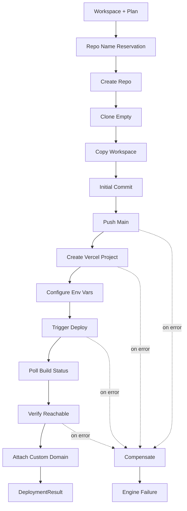

# 14 — Deployment Engine

> The engine that takes an enriched workspace and delivers a running, publicly accessible website to the customer.

---

## Purpose

The Deployment Engine is the platform's output adapter. It performs three jobs:

1. Provisions a Git repository for the generated source code.
2. Publishes the source code to that repository.
3. Provisions a Vercel project, triggers a deployment, and verifies it.

After deployment, it hands off to the Delivery Agent, which is responsible for customer notification and report assembly.

It must succeed under transient failures of GitHub and Vercel. It must compensate on irrecoverable failures so that the platform's state matches reality.

---

## Scope

In scope:

- The deployment pipeline
- GitHub repository provisioning and code push
- Vercel project provisioning and deployment trigger
- Custom domain handling
- Verification and rollback
- Compensation / saga semantics
- Failure modes

Out of scope:

- GitHub API details (`15-github-integration.md`)
- Vercel API details (`16-vercel-integration.md`)
- Notifications to customers (Delivery Agent in `03-agent-architecture.md`)

---

## Engine Architecture



---

## Component Catalogue

### Repo Name Reservation

- Default repo name: `slugify(canonical_root_url.hostname) + "-vibe-" + short_id`.
  - Example: `acme-example-vibe-7f9a`.
- For agency tier with linked GitHub org: name is `slugify(hostname)` with disambiguation on conflict.
- Reservation is performed against the database (`github_repos` unique on `(owner, name)`) before the GitHub call to short-circuit conflicts.

### Create Repo

- Uses the GitHub App installation token scoped to the target org.
- Visibility defaults to `private` (configurable per tier).
- Repo is initialized empty (no auto-README) to allow our exact initial commit.
- Sets `default_branch=main`, applies branch protection (V2+).

### Clone Empty

- Clones the empty repo to a temporary directory.
- Configures local Git identity (`Vibe Bot <bot@vibe.dev>`).
- Sets up commit signing via the GitHub App's GPG key.

### Copy Workspace

- Copies the generated workspace into the clone.
- Excludes `node_modules`, `.next`, `dist`, OS junk files.
- Verifies `.gitignore` covers excluded paths.

### Initial Commit

- Stages all files.
- Commits with a conventional commits message: `feat: initial commit — generated by Vibe (job <id>)`.
- Commit metadata includes:
  - The `job_id` in a trailer (`Vibe-Job-Id: <uuid>`).
  - The engine version in a trailer.
  - A reference to the source URL in the commit body.

### Push Main

- `git push origin main`.
- Tags the commit with `vibe-v1.0.0` (template version + initial version).
- Records the commit SHA in `deployments.metadata`.

### Create Vercel Project

- Calls Vercel API to create a project linked to the GitHub repo.
- Framework: `nextjs` (auto-detected, but explicit).
- Region: `iad1` (primary) by default; tenant override possible.
- Project name mirrors repo name (Vercel-safe slug).

### Configure Env Vars

- Sets any baseline env vars the generated app needs (e.g., `NEXT_PUBLIC_SITE_URL`).
- Customer-supplied env vars (V2+) are injected here.

### Trigger Deploy

- Creates a Vercel deployment (production target).
- Records the Vercel deployment ID in `deployments.external_id`.

### Poll Build Status

- Polls Vercel for build state every 5 seconds, capped at 15 minutes.
- Captures and streams build logs into S3 as they arrive.
- States: `BUILDING`, `READY`, `ERROR`, `CANCELED`.

### Verify Reachable

- After `READY`, performs an HTTPS GET against the deployment URL.
- Expects 200 with `text/html` content type.
- Performs a Lighthouse sanity run (Performance ≥ 75 as a sanity check, not a gate).
- If verification fails, routes to compensation.

### Attach Custom Domain (V2+)

- If a custom domain was requested:
  - Add domain to the Vercel project.
  - Issue DNS instructions to the customer (TXT and/or CNAME).
  - Poll DNS validation for up to 24 hours.
  - On success, mark `custom_domain_status=active`.
  - On timeout, mark `pending`; deliver default URL.

### Compensation

If any irrecoverable step fails after partial provisioning:

- Vercel project created but deploy failed → delete Vercel project.
- Repo created but push failed → delete repo (if empty) or mark as orphan (if any external traffic).
- Repo + Vercel created but verification failed → leave both; mark job `failed` and surface to operator review.

Compensation actions are themselves recorded as audit events.

---

## Output: `DeploymentResult`

```python
class DeploymentResult(BaseModel):
    job_id: UUID
    repo_url: HttpUrl
    repo_default_branch: str
    repo_visibility: Literal["public", "private"]
    repo_owner: str
    repo_name: str
    deployment_url: HttpUrl
    deployment_id: str
    deployment_provider: Literal["vercel"] = "vercel"
    deployment_status: Literal["ready"]
    custom_domain_status: Literal["not_requested", "pending", "active", "failed"]
    build_log_uri: str
    duration_ms: int
```

---

## Configuration

```yaml
deployment:
  github:
    default_visibility: private
    default_branch: main
    bot_identity:
      name: "Vibe Bot"
      email: "bot@vibe.dev"
  vercel:
    default_region: iad1
    framework: nextjs
    build_timeout_seconds: 900
  custom_domain:
    dns_validation_timeout_seconds: 86400
    dns_check_interval_seconds: 60
  verification:
    require_https_200: true
    lighthouse_sanity_min: 75
```

---

## Failure Mode Matrix

| Failure | Detection | Status | Recovery |
|---------|-----------|--------|----------|
| GitHub rate-limit | 429 | retry with backoff | Up to 5 attempts |
| Repo name conflict | 422 | append disambiguator | One retry |
| GitHub auth expired | 401 | refresh installation token | One retry |
| Push fails | git error | retry | One retry; then compensate |
| Vercel project conflict | 409 | append disambiguator | One retry |
| Vercel build error | poll status | route to Generation Agent for diagnosis | Up to 2 redeploys |
| Build timeout | timer | cancel deploy, mark `deploy_timeout` | Compensate |
| Verification fails | HTTP/Lighthouse | mark `deploy_verification_failed` | Compensate |
| Custom domain DNS pending | 24 h timer | mark `pending`, deliver default | Continue |

---

## Performance Targets

| Metric | Target |
|--------|--------|
| End-to-end deploy (after generation) | ≤ 5 min p95 |
| GitHub provisioning + push | ≤ 60 s p95 |
| Vercel build (10 pages) | ≤ 3 min p95 |
| Verification | ≤ 30 s |

---

## Cost Envelope

| Cost driver | Magnitude (per job) |
|-------------|---------------------|
| Compute (deploy worker) | $0.02 |
| GitHub API calls | negligible |
| Vercel platform | included in plan |
| S3 log storage | $0.005 |

Target ≤ $0.10 per job.

---

## Idempotency

All side-effecting operations use job-scoped idempotency keys:

- Repo creation: keyed by `{tenant_id}:{job_id}:repo`.
- Vercel project creation: `{tenant_id}:{job_id}:vercel_project`.
- Deployment trigger: `{tenant_id}:{job_id}:deployment`.

The `idempotency_keys` table records the first successful response; reruns short-circuit to it.

---

## Compensation Registry

For each side-effecting operation, the engine writes a compensation record to a `deployment_compensations` table (in the same transaction as the side effect's audit row). The compensation runs:

- Automatically on terminal engine failure.
- Manually by operator action.

```python
class Compensation(BaseModel):
    job_id: UUID
    operation: str            # "github.create_repo", "vercel.create_project"
    target_id: str            # repo full name, vercel project id
    created_at: datetime
    applied_at: datetime | None
    outcome: str | None
```

---

## Multi-Provider (Future)

The engine is designed so adding Netlify, Cloudflare Pages, or AWS Amplify is a matter of implementing the `DeploymentProvider` interface:

```python
class DeploymentProvider(Protocol):
    name: str
    async def create_project(self, *, repo_url: str, env: dict, region: str) -> ProjectRef: ...
    async def trigger_deploy(self, *, project: ProjectRef, ref: str) -> DeploymentRef: ...
    async def get_deployment_status(self, *, deployment: DeploymentRef) -> DeploymentStatus: ...
    async def attach_domain(self, *, project: ProjectRef, domain: str) -> DomainStatus: ...
    async def delete_project(self, *, project: ProjectRef) -> None: ...
```

Through MVP and V2, the only provider is Vercel. V3 may add others if the cost or partner demand justifies.

---

## Observability

- Span `deployment.run` with `repo_full_name`, `deployment_id`, `duration_ms`, `compensations`.
- Counter `vibe.deployment.success_total`.
- Counter `vibe.deployment.failure_total{reason}`.
- Histogram `vibe.deployment.build_duration_ms`.

---

## Security Considerations

- All GitHub App tokens are minted just-in-time, scoped to a single installation, and never logged.
- Vercel tokens are tenant-scoped and stored in Secrets Manager; the engine retrieves them by ARN at use-time.
- Generated repos default to private; making them public requires an explicit job parameter.
- Generated apps never embed Vibe credentials.

See `17-security-model.md`.

---

## Testing Strategy

- **Unit:** name slugification, idempotency key generation, compensation registry.
- **Integration:** against ephemeral test GitHub org and a Vercel test team. Repos and projects are deleted at teardown.
- **Contract tests:** record-replay (VCR) against GitHub and Vercel APIs.
- **Chaos:** inject 5xx and 429 responses to verify retries and compensations.

See `19-testing-strategy.md`.

---

## Assumptions

- The platform's GitHub App can be installed in customer orgs without elevated permissions.
- Vercel will continue to provide first-class Next.js builds.
- Customers tolerate a deployment URL on a default Vercel subdomain until custom domain is configured.

---

## Design Decisions

| Decision | Rationale |
|----------|-----------|
| Single deployment provider (Vercel) at MVP | Focus, depth of integration. |
| Compensation as a first-class registry | Saga safety on partial failures. |
| Idempotency on all side effects | Safe retries from Temporal. |
| Sign commits with the Bot's GPG key | Trust, auditability. |
| Custom domain optional, default URL always available | Avoids blocking delivery on DNS. |

---

## Open Questions

- Should the engine create a `develop` branch in addition to `main` for future iteration?
- Should we automatically open a PR with a "tour of your new code" for human handoff?
- Should we offer per-customer encryption of repo contents (E2E) for sensitive verticals?

---

## Future Enhancements

- Per-tenant pre-deploy hooks (e.g., post to Slack on deploy).
- Multi-environment deploys (preview branch, production main).
- Per-commit preview deploys with a "what changed" diff URL.
- Optional Netlify or Cloudflare Pages provider at V3.

---

## Cross-References

- GitHub specifics → `15-github-integration.md`
- Vercel specifics → `16-vercel-integration.md`
- Security → `17-security-model.md`
- Database schema → `08-database-design.md` (`deployments`, `github_repos`, `vercel_projects`)
