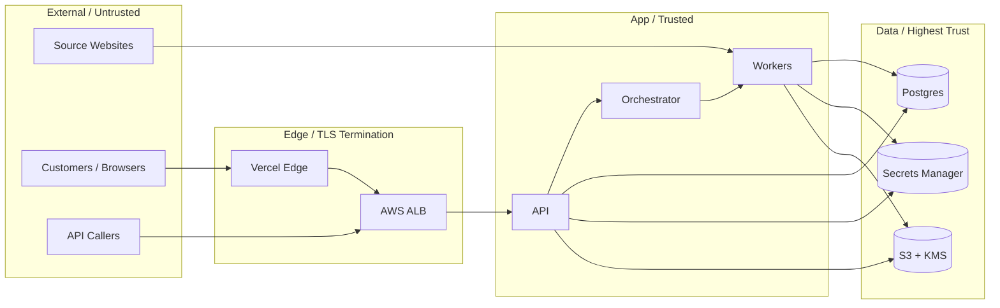

# 17 — Security Model

> The platform's threat model, controls, and policies. The contract every contributor must honor.

---

## Purpose

This document defines the security posture of Vibe. It identifies the assets the platform protects, the threats it defends against, the controls it implements, and the policies that govern operation.

It is binding. Code that violates the controls described here must not be merged. Operational practices that violate the policies described here must not be performed.

---

## Scope

In scope:

- Trust boundaries and asset inventory
- Threat model (STRIDE applied to the platform)
- Authentication and authorization
- Secrets management
- Token lifecycle (Vibe-issued and third-party)
- Network security
- Data classification and handling
- Encryption at rest and in transit
- Abuse prevention and rate limiting
- Tenant isolation
- Customer data egress controls
- Audit and incident response
- Compliance posture

Out of scope:

- Specific provider configurations (`27-production-deployment.md`)
- Observability of security events (`18-observability.md`, but referenced here)

---

## Security Principles

1. **Least privilege everywhere.** Every credential is scoped to the minimum it needs.
2. **No standing credentials in user space.** Production access is mediated, time-bound, audited.
3. **Tenant isolation is non-negotiable.** Cross-tenant access is an immediate-recovery incident.
4. **Defense in depth.** Single controls are not sufficient. Layers compose.
5. **Secrets do not exist in source, logs, or build artifacts.** Period.
6. **Auditable by design.** Every privileged action produces an immutable log.
7. **Plan for breach.** Detection and containment are first-class, not optional.
8. **Customers own their data.** They can export it and delete it on demand.

---

## Asset Inventory

| Asset | Category | Sensitivity |
|-------|----------|-------------|
| Customer source content (HAR, HTML, assets) | Customer data | Confidential (default), customer-classifiable |
| Generated workspaces | Customer data | Confidential |
| Customer reports | Customer data | Confidential |
| Customer email + billing info | PII | Restricted |
| Stripe customer IDs | PII | Restricted |
| Tenant API keys | Credential | Secret |
| GitHub App private key | Credential | Top Secret |
| Vercel tokens (Vibe team) | Credential | Top Secret |
| Vercel tokens (customer-linked) | Credential | Secret (per tenant) |
| LLM provider API keys | Credential | Secret |
| Stripe API keys | Credential | Top Secret |
| Internal observability data | Internal | Internal |
| Operator console access | Identity | Privileged |
| Database backups | Customer data + Credential | Confidential |
| Audit logs | Operational | Internal |

Sensitivity tiers:

- **Public** — fine to expose; e.g., marketing copy.
- **Internal** — Vibe staff only; e.g., dashboards.
- **Confidential** — tenant-scoped; cross-tenant exposure is an incident.
- **Restricted** — PII; subject to GDPR / CCPA handling.
- **Secret** — credentials; rotated on schedule and on suspected compromise.
- **Top Secret** — system-critical credentials; rotated on tighter schedules; access tightly logged.

---

## Trust Boundaries

Boundaries:

- **External → Edge:** TLS 1.3, WAF rules, rate limiting.
- **Edge → App:** mTLS or VPC-only ALB; SG-restricted ingress.
- **App → Data:** IAM, network segmentation, no public reachability.
- **Worker → Source Website:** untrusted; treat all input as hostile.

---

## Threat Model (STRIDE)

The platform's threat model uses STRIDE per high-value asset. Selected highlights below; the full living model lives at `apps/security/threat-model/`.

### Spoofing

- **Threat:** attacker impersonates a customer to submit jobs.
- **Controls:** JWT with short TTL + refresh; magic links bound to email; API keys scoped + hashed; rate limiting per IP and account.

### Tampering

- **Threat:** attacker modifies a customer's job spec or generated output.
- **Controls:** all write operations require authentication; audit log records hash of payload; generated code signed and pushed only by Vibe Bot.

### Repudiation

- **Threat:** customer denies submitting a job.
- **Controls:** immutable audit log of API calls with IP, UA, JWT subject; Stripe receipts as additional evidence.

### Information Disclosure

- **Threat:** customer A reads customer B's data; insider reads customer data without justification.
- **Controls:** tenant filter on every query; RLS (V2); KMS encryption with envelope keys; access reviews; just-in-time access for engineers.

### Denial of Service

- **Threat:** flood of jobs exhausts COGS or capacity.
- **Controls:** rate limiting; quota enforcement; intake denylist; WAF; LLM cost guards per agent run; circuit breakers on external providers.

### Elevation of Privilege

- **Threat:** customer escalates from `viewer` to `admin`.
- **Controls:** role checks at every endpoint; principle of least privilege; admin actions MFA-gated.

---

## Authentication

### Customer Authentication

- **Mechanism:** Passwordless email magic link.
- **Token issuance:** access JWT (15 min) + refresh token (httpOnly cookie, 30 days, sliding).
- **MFA:** TOTP available; required for `admin` role within a customer tenant.
- **Session invalidation:** on password reset (n/a), email change, MFA enrollment changes, explicit logout.
- **Rate limits:** 10 magic-link requests / hour / email; 5 verification attempts / token.

### API Authentication

- **Mechanism:** API keys (`vibe_live_...`, `vibe_test_...`).
- **Storage:** Argon2id hash; plaintext shown once at creation.
- **Scoping:** per-tenant, per-scope (`jobs.read`, `jobs.write`, `webhooks.manage`).
- **Rotation:** customer-controlled; immediate revocation supported.
- **Expiration:** optional per-key expiry.

### Operator Authentication

- **Mechanism:** SSO via WorkOS (Google + GitHub) → JIT account in our directory.
- **MFA:** required (hardware key preferred, TOTP fallback).
- **Session TTL:** 8 hours.
- **Admin actions:** re-prompt for MFA within the past 15 minutes.

### Webhook Inbound (Stripe, GitHub, Vercel)

- HMAC signature verification per provider's spec.
- Timestamp window: 5 minutes.
- Replay protection via signature + recently-seen cache.

---

## Authorization

### Tenant Isolation

- Every tenant-scoped table has `tenant_id`.
- The application layer enforces `tenant_id` filter via a SQLAlchemy event hook that fails closed.
- V2 introduces Postgres Row-Level Security as defense-in-depth.

### Role-Based Access (Within Tenant)

| Role | Capabilities |
|------|--------------|
| `owner` | Everything in the tenant; billing; delete tenant. |
| `admin` | Manage members, API keys, integrations; cannot delete tenant. |
| `operator` | Create and manage jobs. |
| `viewer` | Read-only. |

### Privileged Operator Actions

| Action | Required Auth | Audited |
|--------|---------------|---------|
| Suspend a tenant | Operator role + MFA | Yes |
| Manual refund | Operator + MFA | Yes |
| Replay job | Operator | Yes |
| Override quality gate | Operator + MFA | Yes |
| Download artifact for support | Operator | Yes (with reason) |
| Read raw agent traces | Operator | Yes |
| Inspect production DB | Just-in-time + MFA + reason | Yes |

---

## Secrets Management

### Storage

- AWS Secrets Manager only. No `.env` files in production. No secrets in source.
- Secrets are referenced by ARN in application config; values fetched at boot or first use, cached in memory with short TTL.
- KMS keys are environment-scoped.

### Rotation

| Secret | Rotation Schedule | Mechanism |
|--------|-------------------|-----------|
| GitHub App private key | Quarterly | Manual via runbook |
| GitHub App webhook secret | Quarterly | Manual via runbook |
| Vercel team token | Quarterly | Manual via runbook |
| Stripe restricted keys | Quarterly | Manual via runbook |
| LLM provider keys | Quarterly | Manual via runbook |
| Database master password | Quarterly | RDS-assisted |
| JWT signing key | Annually + emergency | Two-key rolling (current + previous accepted for 24 h) |

All rotations on detection of compromise: immediate.

### Detection

- Pre-commit secret scan (Gitleaks).
- CI secret scan blocking merge.
- Periodic full-repo scan.
- Log scan for accidental secret emission.

---

## Network Security

- All ingress through ALB or Vercel Edge. No EC2/ECS task is publicly reachable.
- Private subnets for app and data tiers.
- Security groups: explicit ingress; no `0.0.0.0/0` except on ALB (HTTPS only).
- VPC endpoints for S3, Secrets Manager, ECR to avoid public traversal.
- WAF rules: OWASP Top 10 ruleset; bot management; rate-based blocks.

---

## Encryption

### In Transit

- TLS 1.3 on all public endpoints; TLS 1.2 minimum for legacy clients.
- Internal traffic between services in VPC: TLS (preferred) or plaintext over private subnets (acceptable for MVP).
- Database connections: TLS required.

### At Rest

- RDS, EBS, S3 encrypted with KMS keys.
- Per-environment KMS keys.
- Secret values in Secrets Manager encrypted with a dedicated KMS key.

### Application-Layer Encryption

- Webhook secrets and Vercel access tokens are encrypted at the application layer using KMS-envelope encryption before being written to Postgres.
- Plaintext exists only in memory and in Secrets Manager.

---

## Customer Data Handling

### Classification at Intake

- Source URL → Public (the URL itself; the content classification depends on the source).
- Captured content → Confidential (default); customer can request Restricted handling.
- Generated source code → Confidential.
- Reports → Confidential.

### Storage

- S3 buckets segregated per environment.
- Object keys prefixed with `tenant_id` for IAM-based isolation.
- Lifecycle policies enforce retention NFRs (`06-nonfunctional-requirements.md`).

### Egress

- Customer data never leaves Vibe's controlled environment except via:
  - Customer-initiated exports (signed URLs, time-bound).
  - Documented integrations: GitHub (the repo we create), Vercel (the deploy).
  - Webhooks to customer-registered endpoints.
- LLM provider calls send extracted text and structured data; no raw HAR or screenshots are sent.
- LLM provider data-retention settings are configured to "no training, no retention" where supported.

### Deletion

- Customers may delete their tenant via the dashboard.
- Hard deletion of customer data within 30 days, including S3 artifacts.
- A tombstone record retains the tenant ID and deletion timestamp.

---

## Source Site Risks (Untrusted Input)

Customer-supplied URLs are untrusted input. Mitigations:

- **SSRF defense.** Resolve hostname before fetching; refuse private IPs, link-local addresses, metadata service addresses (`169.254.169.254`).
- **Egress firewall.** Workers may only initiate outbound connections to public HTTPS hosts on standard ports.
- **Container isolation.** Capture workers run in single-tenant ephemeral containers with no AWS metadata access (IMDSv2 enforced; tasks run with hop-limit 1 to block lateral curl).
- **Resource limits.** CPU, memory, disk, network bandwidth bounded per task.
- **Content sanitization.** Captured HTML is parsed in a sandboxed parser. JavaScript is never re-executed by analysis or generation.

---

## Generated Code Risks

The platform produces code that customers run. Risks include:

- Supply-chain vulnerabilities in pinned dependencies.
- Mis-configured headers (CSP, HSTS).
- Unsafe HTML interpolation.

Controls:

- All dependencies pinned via lockfile.
- Pre-publish scan of dependencies via Snyk or equivalent.
- Generated app sets safe defaults: HSTS, X-Content-Type-Options, X-Frame-Options, Referrer-Policy, modest CSP.
- No `dangerouslySetInnerHTML` except for JSON-LD (validated input).
- Output of LLM-generated code is statically analyzed for known dangerous patterns (e.g., `eval`, `Function()`, `child_process`).

---

## Abuse Prevention

| Vector | Control |
|--------|---------|
| URL spam / DoS via job submission | Per-tenant + per-IP rate limit at intake; quota per tier |
| Captcha bypass on free preview | invisible reCAPTCHA + rate limit |
| Stolen credit cards | Stripe Radar |
| Resource exhaustion via giant sites | hard caps on pages, asset bytes, capture time |
| Egress abuse via SSRF | private-IP filter; egress firewall |
| LLM cost abuse | per-agent cost envelopes; per-tenant daily LLM spend cap |
| API key brute force | Argon2id hash; constant-time compare; lockout |

---

## Audit Logging

The `audit_log` table records (minimum):

- Authentication events (success, failure)
- Authorization decisions (denials)
- Admin actions (suspensions, refunds, overrides)
- Data exports
- Configuration changes (env vars, secrets refs)
- Tenant lifecycle (create, suspend, delete)

Retention: 365 days.

All audit log writes are immutable from the application; rotation to an append-only archive is performed monthly.

---

## Vulnerability Management

- SBOM generated on every build (CycloneDX format).
- Vulnerability scanning (Snyk, Trivy) on every build.
- Severity SLAs:
  - Critical: patched within 7 days
  - High: within 30 days
  - Medium: within 90 days
- Public disclosure: coordinated; security@vibe.dev with PGP key.

---

## Incident Response

### Severities

| Severity | Definition | Response Time |
|----------|------------|---------------|
| SEV1 | Cross-tenant data exposure, credential compromise, prolonged downtime | Page on-call within 5 min; 24/7 |
| SEV2 | Partial outage, single-tenant data integrity issue | Within 30 min business hours |
| SEV3 | Degradation, no data impact | Same business day |

### Process

1. Detect (alert, customer report).
2. Triage (on-call assesses severity).
3. Contain (revoke credentials, isolate components).
4. Eradicate (patch, rotate keys).
5. Recover (restore service).
6. Postmortem (within 5 business days; blameless).

Runbooks live in `apps/runbooks/incident-response/`.

---

## Compliance Posture

- **GDPR**: data minimization, right to deletion, DPA, SCCs for EU customers.
- **CCPA**: applies to California customers; supported via the same controls.
- **SOC2 Type I** target: M5.
- **SOC2 Type II** target: M6.
- **PCI**: not in scope (Stripe handles cardholder data).
- **HIPAA**: not in scope; explicitly excluded from acceptable use.

---

## Acceptable Use

Vibe will not modernize websites for:

- Adult content
- Gambling (unless properly licensed and a Restricted tier is enabled)
- Sanctioned regimes per OFAC
- Content promoting illegal activity
- Content infringing third-party rights (best-effort)

Enforcement: intake denylist + manual review of flagged content.

---

## Open Questions

- Do we need a bug bounty program at MVP or wait until V2?
- Should we encrypt customer artifacts with a per-tenant KMS key (vs. shared env key) for higher segregation?
- Should we offer a "no LLM training, signed" data-handling certificate to enterprise customers?

---

## Future Enhancements

- Hardware-key (FIDO2) requirement for production access (V2).
- Per-tenant KMS keys (V2).
- Customer-managed encryption keys (BYOK) for enterprise (V3).
- Continuous compliance evidence collection (Drata, Vanta) (V2).
- Public security disclosure page (V2).

---

## Cross-References

- Database isolation → `08-database-design.md`
- Observability → `18-observability.md`
- Production ops → `27-production-deployment.md`
- Risk register → `25-risk-analysis.md`
