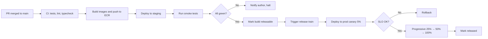

# 27 — Production Deployment

> How code reaches production, how it stays healthy there, and how we recover when it doesn't.

---

## Purpose

This document describes the production deployment of Vibe. It covers the cloud architecture, the deployment pipelines, the rollout strategy, the rollback procedures, and the operational practices that keep production reliable.

The production environment is the contract we keep with customers. Everything in this document exists to ensure that contract is met with the highest possible consistency.

---

## Scope

In scope:

- Cloud architecture
- Environments
- Deployment pipelines
- Rollout strategy
- Database migration process
- Observability in production
- On-call and incident response
- Backup and disaster recovery
- Cost controls

Out of scope:

- Security model (`17-security-model.md`)
- Observability details (`18-observability.md`)

---

## Principles

1. **Automate everything.** No manual steps in the deploy path.
2. **Ship small and ship often.** Smaller changes are safer changes.
3. **Reverse the deploy, not the data.** Schema changes are forward-compatible.
4. **Observe the change.** Every deploy is verified by metrics.
5. **Practice the disaster.** Rollback is rehearsed, not improvised.

---

## Cloud Architecture (AWS-Primary)

The production environment runs on AWS.

| Concern | AWS Service |
|---------|-------------|
| API | ECS Fargate behind ALB |
| Workers | ECS Fargate |
| Web dashboard | Vercel |
| Delivered sites | Vercel |
| Database | RDS Postgres 16 (Multi-AZ) |
| Cache / Queue | ElastiCache Redis 7.4 |
| Object storage | S3 |
| Secrets | Secrets Manager |
| Orchestrator | Self-hosted Temporal 1.25 on ECS Fargate |
| Observability | Grafana Cloud (Tempo, Loki, Mimir) |
| Error tracking | Sentry |
| Email | SES (with SNS for bounces) |
| CDN | CloudFront (where needed) |
| DNS | Route 53 |
| IaC | Terraform |

A multi-region strategy is on the V3 roadmap.

---

## Environments

| Environment | Purpose | Data | Access |
|-------------|---------|------|--------|
| `dev` (local) | Local dev | Synthetic | Developer |
| `pr-preview` | Per-PR ephemeral | Synthetic | PR author + reviewers |
| `staging` | Mirrors prod | Synthetic (sandbox tenants) | Eng, QA, Support |
| `prod` | Production | Real (with PII handling) | On-call, SRE, Eng leads |

Each environment has its own:

- AWS account or VPC
- Database, Redis, S3 buckets
- Secrets
- Observability workspace
- GitHub App (or Vercel team)

Promotion flow: `dev` → `pr-preview` → `staging` → `prod`.

---

## Deployment Pipeline

### Build

- Docker images built per app with multi-stage builds.
- Images signed with cosign; signatures verified on pull.
- Tags: `<git-sha>`, `<semver>` (on tags).
- Images are scanned (Trivy) in CI.

### Continuous Deployment (Staging)

- Every merge to `main` triggers a deploy to staging.
- Smoke tests run for 10 minutes.
- If green, the build is releasable.

### Progressive Production Rollout

- Canary 5% of traffic for 10 minutes.
- Step 25% for 15 minutes.
- Step 50% for 15 minutes.
- Step 100%.
- Each step has automatic halt criteria:
  - API 5xx > 1%
  - API p95 > 2× baseline
  - LLM cost burn > 200% of forecast
  - Database error rate > 0.5%
  - Worker queue lag > 5 min
- Halt triggers automatic rollback to the last good build.

### Manual Promotion (Hotfixes)

- A `release-train` workflow can be skipped for a hotfix.
- Hotfix builds still pass all gates; rollout is faster.

---

## Database Migrations

- Migrations are forward-only.
- A migration is part of the same release as the app change that requires it.
- Migrations run in a separate job before the app rollout starts.
- A migration is "expand-contract" by default:
  - Add a column or table.
  - App code reads/writes both old and new shapes.
  - A subsequent release removes the old shape.
- Long-running migrations are split or performed online.
- A migration that fails halts the rollout.

---

## Configuration and Secrets

- Configuration is environment-specific; defaults live in code; overrides live in environment variables.
- Secrets are stored in AWS Secrets Manager and referenced by ARN.
- The application fetches secrets at boot, with a 5-minute refresh.
- No secret in source, no secret in env files in production.

---

## Observability in Production

See `18-observability.md` for full details. Highlights:

- OpenTelemetry traces flow to Tempo.
- Metrics to Mimir.
- Logs to Loki.
- Errors to Sentry.
- SLOs page on burn rate.

A health check at `/healthz` is comprehensive:

- API liveness
- Database connectivity
- Redis connectivity
- Temporal reachability
- LLM provider reachability (probes every minute)

---

## Incident Response

### Detection

- Alerts (SLO burn, error spike, queue lag).
- Customer reports (Support channel).
- Synthetic monitoring.

### Triage

- On-call acknowledges within 5 minutes (SEV1) or 30 minutes (SEV2).
- Severity is set; incident channel created.

### Mitigation

- Rollback the latest release if it's a regression.
- Disable a feature flag.
- Increase capacity.
- Switch to fallback providers.
- Communicate to customers via the status page.

### Postmortem

- Blameless.
- Within 5 business days.
- Action items tracked.

---

## On-Call

- Weekly rotation, primary + secondary.
- 24/7 paging for SEV1.
- Business hours for SEV2.
- Compensation per company policy.
- Training and shadow shifts for new on-call.

---

## Backup and Disaster Recovery

### Backups

- **Postgres**: automated daily snapshots; PITR enabled; 35-day retention.
- **S3**: versioning enabled; lifecycle policies retain artifacts per `06-nonfunctional-requirements.md`.
- **Secrets**: secrets replicated across AZs by AWS.
- **Audit logs**: copied to an append-only archive; 365-day retention.

### Recovery

- A restore drill runs monthly in staging.
- RPO target: 5 minutes (PITR).
- RTO target: 30 minutes for service, 4 hours for full stack.

### Disaster Recovery

- Multi-AZ for database and most services.
- A read replica in a second region (V2) for true DR.
- Documented runbook in `apps/runbooks/dr/`.

---

## Cost Controls

- Per-tenant LLM spend cap.
- Per-job cost envelope.
- Per-tenant capture pages cap.
- Per-tenant deploys cap.
- AWS budgets with alerts at 80% and 100%.
- Scheduled scaling to reduce off-hours cost.

---

## Feature Flags

- Flags live in a dedicated service; tenant-scoped.
- Booting reads the flag set; updates propagate via SSE.
- Production changes default-off unless explicitly enabled.
- Flag state is recorded in audit log.

---

## Schema and API Versioning

- Database schema is forward-only; no breaking renames.
- Public API uses `/v1/`. Breaking changes introduce `/v2/`.
- Internal APIs version per build SHA.

---

## Performance and Capacity

- Capacity plan updated quarterly (`25-risk-analysis.md`).
- Auto-scaling on CPU and queue depth.
- DB connections pooled (RDS Proxy).
- Pre-warm jobs at peak times.

---

## Compliance

- Logs scrub PII at the collector.
- Access to production requires JIT elevation.
- All admin actions audit-logged.
- Compliance evidence collected continuously (V2).

---

## Operational Readiness Review (ORR)

Before M0 exits, an ORR validates:

- Deploy pipeline reproducible from a clean slate.
- Rollback tested end-to-end.
- On-call runbooks complete.
- Observability SLOs visible.
- Backups verified.
- Cost controls verified.

The ORR is repeated at every Tier 1 risk change.

---

## Assumptions

- The team has AWS expertise.
- Terraform is the IaC of choice.
- We can self-host Temporal on ECS Fargate at MVP scale.

---

## Design Decisions

| Decision | Rationale |
|----------|-----------|
| AWS primary | Best fit for the workloads. |
| ECS Fargate | Operational simplicity. |
| Vercel for web and sites | Best DX, best edge. |
| Self-hosted Temporal | Cost and control. |
| Progressive rollout | Limits blast radius. |
| Forward-only migrations | Reversibility without data loss. |
| Multi-AZ, not multi-region at MVP | Right-sized for MVP; DR via backups. |

---

## Open Questions

- Should we adopt AWS Graviton for compute savings?
- Should we move to EKS if container orchestration grows complex?

---

## Future Enhancements

- Multi-region active-active (V3).
- Per-tenant data residency (V2/V3).
- Blue/green for the database (V2).
- Chaos engineering drills (V2).

---

## Cross-References

- Observability → `18-observability.md`
- Security → `17-security-model.md`
- Cost → `28-cost-model.md`
- Local dev → `26-local-development.md`
- Roadmap → `23-milestone-roadmap.md`
